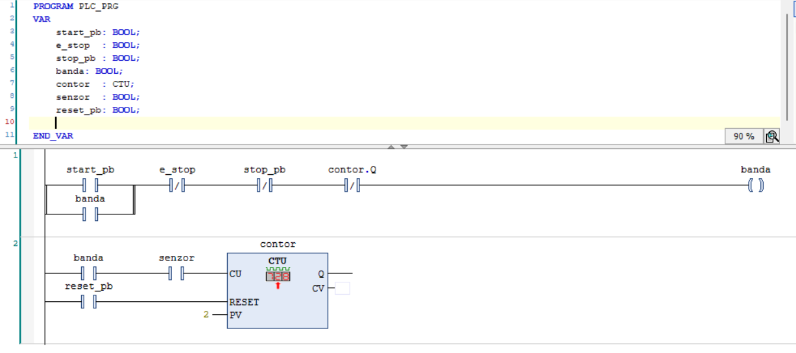

# Conveyor Belt Counter (CTU)

**🇷🇴 Română** · [**🇬🇧 For English, click here →**](#english)

---

## Descriere

Un program de control pentru o bandă transportoare care oprește automat banda după
ce un număr presetat de produse a trecut prin dreptul unui senzor. Realizat în
**Ladder Logic (LD)** folosind **CODESYS V3.5** și testat cu simulatorul integrat.

## Ce face

Produsele se deplasează pe bandă și trec prin dreptul unui senzor. Fiecare produs
este numărat de un contor **CTU (Count Up)**. Când numărătoarea atinge valoarea
presetată (**2** în acest exemplu), ieșirea contorului oprește banda. Apăsarea
butonului de reset (`reset_pb`) șterge numărătoarea și pregătește sistemul pentru
următorul lot.

## Concepte demonstrate

- **Contor CTU** – numărarea evenimentelor discrete (produse) până la o valoare presetată
- **Control pe bază de preset** – folosirea ieșirii contorului (`Q`) pentru a opri
  un actuator la atingerea țintei
- **Logică de resetare** – resetarea valorii acumulate printr-un buton
- **Contacte NC vs NO** – utilizarea corectă a contactelor normal-închise /
  normal-deschise pentru pornire/oprire sigură

## Cum funcționează

1. Fiecare front crescător de la senzorul de produs incrementează contorul CTU.
2. Când valoarea acumulată (`CV`) atinge presetul (`PV = 2`), ieșirea `Q` devine `TRUE`.
3. `Q` întrerupe rung-ul care menține motorul benzii alimentat, deci banda se oprește.
4. `reset_pb` activează intrarea de reset a contorului, aducând `CV` înapoi la 0 și
   permițând începerea unui nou lot.

Numele exacte ale variabilelor și structura rung-urilor se văd în captura de mai jos.

## Cum îl rulezi

1. Deschide fișierul `.project` în **CODESYS V3.5**.
2. Din bară, selectează **Online → Simulation** pentru a activa simulatorul.
3. **Login** și **Start**.
4. Comută intrarea senzorului de două ori ca să vezi contorul atingând presetul și
   oprind banda, apoi apasă `reset_pb` pentru a reîncepe.

## Construit cu

- CODESYS V3.5 (simulator integrat)
- Limbaj: Ladder Logic (LD)

---

# English version

[← Înapoi la română](#conveyor-belt-counter-ctu)

## Description

A conveyor belt control program that automatically stops the belt after a preset
number of products has passed a sensor. Built in **Ladder Logic (LD)** using
**CODESYS V3.5** and tested with the built-in simulator.

## What it does

Products travel along the conveyor and pass a photoelectric sensor. Each product
is counted by a **CTU (Count Up)** counter. Once the count reaches the preset
value (**2** in this example), the counter's output turns the belt off. Pressing
the reset button (`reset_pb`) clears the count and prepares the system for the
next batch.

## Concepts demonstrated

- **CTU counter** – counting discrete events (products) up to a preset value
- **Preset-based control** – using the counter output (`Q`) to stop an actuator
  when a target count is reached
- **Counter reset logic** – resetting the accumulated value via a push button
- **NC vs NO contacts** – correct use of normally-open / normally-closed contacts
  for safe start/stop behaviour

## How it works

1. Every rising edge from the product sensor increments the CTU.
2. When the accumulated value (`CV`) reaches the preset (`PV = 2`), the counter
   output `Q` becomes `TRUE`.
3. `Q` breaks the rung that keeps the conveyor motor energised, so the belt stops.
4. `reset_pb` sets the counter's reset input, clearing `CV` back to 0 and allowing
   a new batch to start.

The exact variable names and rung structure are visible in the screenshot below.

## How to run it

1. Open the `.project` file in **CODESYS V3.5**.
2. From the toolbar, select **Online → Simulation** to enable the simulator.
3. **Login** and **Start** the program.
4. Toggle the product sensor input twice to watch the counter reach its preset and
   stop the belt, then press `reset_pb` to start again.

## Built with

- CODESYS V3.5 (built-in simulator)
- Language: Ladder Logic (LD)
