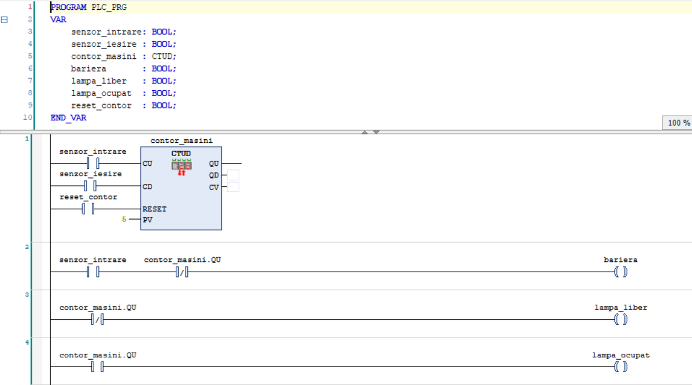

# Parking System (CTUD)

**🇷🇴 Română** · [**🇬🇧 For English, click here →**](#english)

---

## Descriere

Un sistem de parcare care ține evidența locurilor ocupate în timp real, numărând
mașinile care intră și ies. Comandă o barieră de acces și două lămpi de stare
(loc liber / parcare plină). Realizat în **Ladder Logic (LD)** cu **CODESYS V3.5**
și testat pe simulatorul integrat.

## Ce face

Un contor bidirecțional **CTUD** numără mașinile: `senzor_intrare` incrementează
la fiecare intrare, `senzor_iesire` decrementează la fiecare ieșire. Presetul este
**5 locuri** (`PV = 5`). Când parcarea se umple, ieșirea `QU` a contorului devine
`TRUE`, aprinde lampa „ocupat", stinge lampa „liber" și împiedică deschiderea
barierei. `reset_contor` readuce numărătoarea la zero.

## Concepte demonstrate

- **Contor CTUD** – numărare bidirecțională (intrări și ieșiri) cu un singur bloc
- **Urmărirea ocupării** – un singur contor ține locurile ocupate în timp real
- **Detecție „plin"** – folosirea ieșirii `QU` (activă când `CV ≥ PV`)
- **Indicatoare complementare** – același semnal `QU` comandă două lămpi opuse
  prin contact NC (liber) și NO (ocupat)
- **Interlock de siguranță** – bariera se deschide doar dacă parcarea nu e plină

## Cum funcționează

1. `senzor_intrare` → intrarea `CU`: incrementează la fiecare mașină care intră.
2. `senzor_iesire` → intrarea `CD`: decrementează la fiecare mașină care iese.
3. `PV = 5`. Când `CV` atinge 5, ieșirea `QU` devine `TRUE` (parcare plină).
4. **Barieră** (rung 2): se deschide când o mașină e la intrare (`senzor_intrare`)
   **și** parcarea nu e plină (contact NC pe `contor_masini.QU`).
5. **Lampa „liber"** (rung 3): aprinsă cât timp nu e plin (contact NC pe `QU`).
   **Lampa „ocupat"** (rung 4): aprinsă când e plin (contact NO pe `QU`).
6. `reset_contor` resetează contorul la 0.

## Cum îl rulezi

1. Deschide fișierul `.project` în **CODESYS V3.5**.
2. Din bară, selectează **Online → Simulation**, apoi **Login** și **Start**.
3. Comută `senzor_intrare` de câteva ori ca să „umpli" parcarea: vezi cum `CV`
   crește, iar la 5 se aprinde `lampa_ocupat` și bariera nu mai răspunde la intrare.
4. Comută `senzor_iesire` ca să eliberezi locuri, sau `reset_contor` ca să resetezi.

## Construit cu

- CODESYS V3.5 (simulator integrat)
- Limbaj: Ladder Logic (LD)

---

# English version

[← Înapoi la română](#parking-system-ctud)

## Description

A parking system that tracks occupied spaces in real time by counting cars as they
enter and leave. It drives an entry barrier and two status lamps (space available /
lot full). Built in **Ladder Logic (LD)** with **CODESYS V3.5** and tested on the
built-in simulator.

## What it does

A bidirectional **CTUD** counter tracks the cars: `senzor_intrare` (entry sensor)
counts up on each entry, `senzor_iesire` (exit sensor) counts down on each exit.
The preset is **5 spaces** (`PV = 5`). When the lot fills up, the counter's `QU`
output becomes `TRUE`, turning on the "occupied" lamp, turning off the "vacant"
lamp, and preventing the barrier from opening. `reset_contor` clears the count.

## Concepts demonstrated

- **CTUD counter** – bidirectional counting (entries and exits) with a single block
- **Occupancy tracking** – one counter holds the number of used spaces in real time
- **"Full" detection** – using the `QU` output (active when `CV ≥ PV`)
- **Complementary indicators** – the same `QU` signal drives two opposite lamps via
  an NC contact (vacant) and an NO contact (occupied)
- **Safety interlock** – the barrier only opens when the lot is not full

## How it works

1. `senzor_intrare` → `CU` input: counts up on each car entering.
2. `senzor_iesire` → `CD` input: counts down on each car leaving.
3. `PV = 5`. When `CV` reaches 5, the `QU` output becomes `TRUE` (lot full).
4. **Barrier** (rung 2): opens when a car is at the entry (`senzor_intrare`) **and**
   the lot is not full (NC contact on `contor_masini.QU`).
5. **Vacant lamp** (rung 3): on while not full (NC contact on `QU`).
   **Occupied lamp** (rung 4): on when full (NO contact on `QU`).
6. `reset_contor` resets the counter to 0.

## How to run it

1. Open the `.project` file in **CODESYS V3.5**.
2. From the toolbar, select **Online → Simulation**, then **Login** and **Start**.
3. Toggle `senzor_intrare` a few times to fill the lot: watch `CV` climb, and at 5
   the `lampa_ocupat` lamp turns on and the barrier stops responding to entries.
4. Toggle `senzor_iesire` to free spaces, or `reset_contor` to reset.

## Built with

- CODESYS V3.5 (built-in simulator)
- Language: Ladder Logic (LD)
