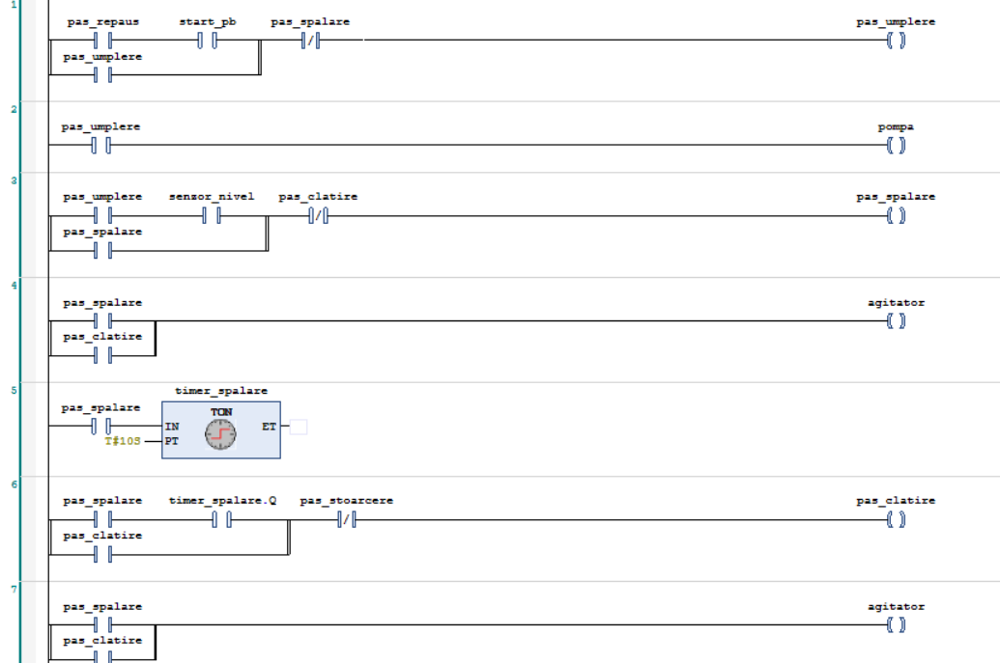
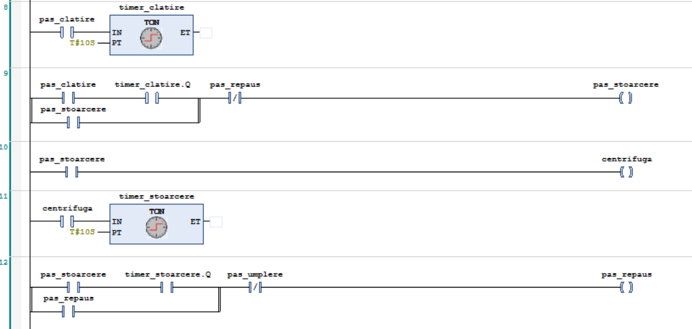
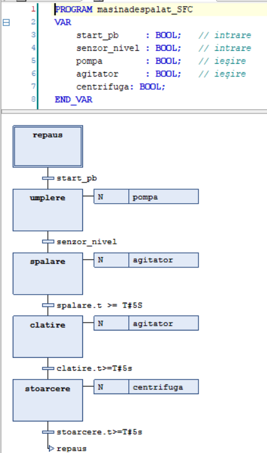
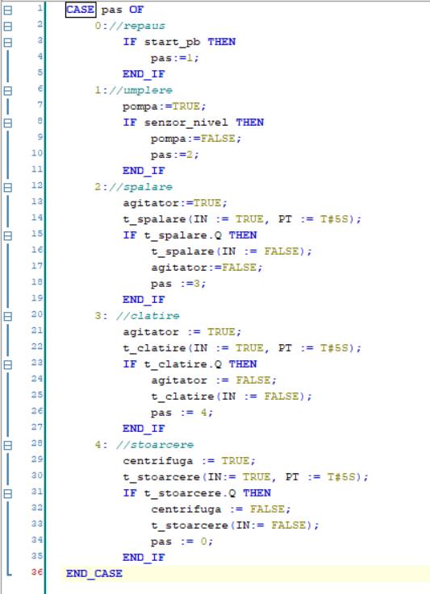

# Washing Machine — Sequential Control (Ladder · SFC · ST)

**🇷🇴 Română** · [**🇬🇧 For English, click here →**](#english)

---

## Descriere

Procesul secvențial al unei mașini de spălat — **repaus → umplere → spălare →
clătire → stoarcere → repaus** — implementat în **trei limbaje IEC 61131-3
diferite** în CODESYS V3.5: **Ladder Logic (LD)**, **Sequential Function Chart
(SFC)** și **Structured Text (ST)**. Aceeași logică de control, trei paradigme —
ca să arăt cum se traduce un proces secvențial dintr-un limbaj în altul.

## Procesul

| Pas | Fază | Ieșire activă | Condiție de avans |
|-----|------|---------------|-------------------|
| 0 | Repaus | — | butonul `start_pb` apăsat |
| 1 | Umplere | `pompa` | `senzor_nivel` atins |
| 2 | Spălare | `agitator` | temporizatorul expiră |
| 3 | Clătire | `agitator` | temporizatorul expiră |
| 4 | Stoarcere | `centrifuga` | temporizatorul expiră → revine la Repaus |

**Intrări:** `start_pb` (buton pornire), `senzor_nivel` (senzor de nivel al apei)
**Ieșiri:** `pompa` (umplere), `agitator` (motor cuvă), `centrifuga` (stoarcere)

## Implementări

### 1. Ladder Logic (LD)

Folosește câte o **variabilă de memorie pentru fiecare pas** (`pas_repaus`,
`pas_umplere`, `pas_spalare`, `pas_clatire`, `pas_stoarcere`) cu **latching
(seal-in)**. Fiecare pas își menține starea până când pasul următor devine activ;
contactul **NC** al pasului următor întrerupe pasul curent, realizând predarea
secvenței. Fazele temporizate folosesc blocuri **TON** (`timer_spalare`,
`timer_clatire`, `timer_stoarcere`, `PT = T#10S`), iar ieșirile fizice sunt
comandate din biții de pas.

### 2. Sequential Function Chart (SFC)

Aceeași logică, exprimată nativ ca **grafic de pași și tranziții**. Fiecare pas
comandă ieșirea prin **acțiuni de tip N** (non-stocate): `umplere` → `pompa`,
`spalare` / `clatire` → `agitator`, `stoarcere` → `centrifuga`. Tranzițiile se fac
pe **senzor** (`start_pb`, `senzor_nivel`) sau pe **timpul scurs în pas** folosind
`nume_pas.t >= T#5S` — CODESYS oferă temporizarea gratuit, fără blocuri TON.

### 3. Structured Text (ST)

Aceeași secvență, scrisă compact ca **mașină de stări** cu o instrucțiune
`CASE pas OF`. Variabila întreagă `pas` ține starea curentă, iar fiecare ramură
setează ieșirile și avansează la pasul următor. Temporizarea folosește instanțe
**TON** (`t_spalare`, `t_clatire`, `t_stoarcere`) apelate cu `IN` și `PT := T#5S`.

## Comparație între cele trei

| Aspect | Ladder (LD) | SFC | Structured Text (ST) |
|--------|-------------|-----|----------------------|
| Starea curentă | biți de memorie (`pas_*`) | pași nativi SFC | variabilă întreagă `pas` |
| Avansul secvenței | contact NC al pasului următor | tranziție între pași | atribuire `pas := n` |
| Temporizare | blocuri TON | timpul scurs în pas (`.t`) | instanțe TON (`IN` / `PT`) |
| Ieșiri | bobine din biții de pas | acțiuni de tip N | atribuiri în `CASE` |
| Punct forte | familiar electricienilor | flux vizual al procesului | compact și ușor de întreținut |

## Concepte demonstrate

- **Control secvențial / mașină de stări** – același proces în trei paradigme
- **Pattern de memorie a pașilor cu seal-in** (Ladder)
- **Pași, tranziții și acțiuni N** în SFC, cu temporizare pe timpul scurs în pas
- **Mașină de stări cu `CASE`** și blocuri funcționale **TON** în ST
- **Tranziții pe senzor vs. pe timp** – umplerea se termină pe `senzor_nivel`,
  fazele de spălare/clătire/stoarcere pe temporizator

## Cum îl rulezi

1. Deschide fișierul `.project` în **CODESYS V3.5**.
2. Alege implementarea dorită (POU-ul de Ladder, SFC sau ST) ca program activ al task-ului.
3. Selectează **Online → Simulation**, apoi **Login** și **Start**.
4. Apasă `start_pb` ca să pornești ciclul, comută `senzor_nivel` ca să încheie
   umplerea și urmărește cum programul parcurge automat spălarea, clătirea și
   stoarcerea, apoi revine la repaus.

## Construit cu

- CODESYS V3.5 (simulator integrat)
- Limbaje: Ladder Logic (LD), Sequential Function Chart (SFC), Structured Text (ST)

---

# English version

[← Înapoi la română](#top)

## Description

The sequential process of a washing machine — **idle → fill → wash → rinse →
spin → idle** — implemented in **three different IEC 61131-3 languages** in
CODESYS V3.5: **Ladder Logic (LD)**, **Sequential Function Chart (SFC)**, and
**Structured Text (ST)**. Same control logic, three paradigms — to show how a
sequential process translates from one language to another.

## The process

| Step | Phase | Active output | Advance condition |
|------|-------|---------------|-------------------|
| 0 | Idle | — | `start_pb` button pressed |
| 1 | Fill | `pompa` (pump) | `senzor_nivel` (level sensor) reached |
| 2 | Wash | `agitator` | timer elapses |
| 3 | Rinse | `agitator` | timer elapses |
| 4 | Spin | `centrifuga` | timer elapses → returns to Idle |

**Inputs:** `start_pb` (start button), `senzor_nivel` (water level sensor)
**Outputs:** `pompa` (fill pump), `agitator` (drum motor), `centrifuga` (spin motor)

## Implementations

### 1. Ladder Logic (LD)

Uses a **step-memory variable for each step** (`pas_repaus`, `pas_umplere`,
`pas_spalare`, `pas_clatire`, `pas_stoarcere`) with **seal-in latching**. Each step
holds its state until the next one becomes active; the **NC contact** of the next
step breaks the current one, handing over the sequence. Timed phases use **TON**
blocks (`timer_spalare`, `timer_clatire`, `timer_stoarcere`, `PT = T#10S`), and the
physical outputs are driven from the step bits.

### 2. Sequential Function Chart (SFC)

The same logic, expressed natively as a **chart of steps and transitions**. Each
step drives its output through **N (non-stored) actions**: `fill` → `pompa`,
`wash` / `rinse` → `agitator`, `spin` → `centrifuga`. Transitions fire on a
**sensor** (`start_pb`, `senzor_nivel`) or on the **step elapsed time** using
`step_name.t >= T#5S` — CODESYS provides the timing for free, no TON blocks needed.

### 3. Structured Text (ST)

The same sequence, written compactly as a **state machine** with a `CASE pas OF`
statement. The integer variable `pas` holds the current state, and each branch sets
the outputs and advances to the next step. Timing uses **TON** instances
(`t_spalare`, `t_clatire`, `t_stoarcere`) called with `IN` and `PT := T#5S`.

## Comparison of the three

| Aspect | Ladder (LD) | SFC | Structured Text (ST) |
|--------|-------------|-----|----------------------|
| Current state | memory bits (`pas_*`) | native SFC steps | integer variable `pas` |
| Advancing the sequence | NC contact of next step | transition between steps | assignment `pas := n` |
| Timing | TON blocks | step elapsed time (`.t`) | TON instances (`IN` / `PT`) |
| Outputs | coils from step bits | N-qualified actions | assignments inside `CASE` |
| Strength | familiar to electricians | visual process flow | compact and maintainable |

## Concepts demonstrated

- **Sequential control / state machine** – the same process in three paradigms
- **Step-memory pattern with seal-in latching** (Ladder)
- **Steps, transitions, and N-actions** in SFC, timed via step elapsed time
- **`CASE`-based state machine** with **TON** function blocks in ST
- **Sensor-driven vs. time-driven transitions** – filling ends on `senzor_nivel`,
  the wash/rinse/spin phases end on a timer

## How to run it

1. Open the `.project` file in **CODESYS V3.5**.
2. Choose the implementation you want (the Ladder, SFC, or ST POU) as the task's active program.
3. Select **Online → Simulation**, then **Login** and **Start**.
4. Press `start_pb` to begin the cycle, toggle `senzor_nivel` to end filling, and
   watch the program step automatically through wash, rinse, and spin, then return
   to idle.

## Built with

- CODESYS V3.5 (built-in simulator)
- Languages: Ladder Logic (LD), Sequential Function Chart (SFC), Structured Text (ST)
