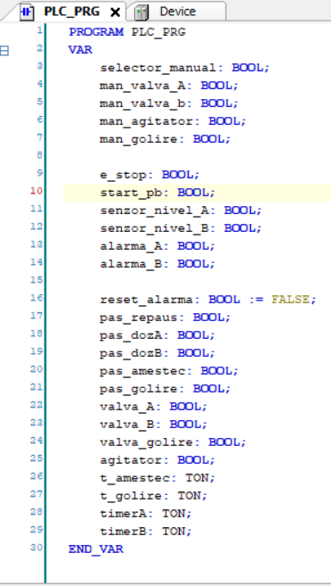
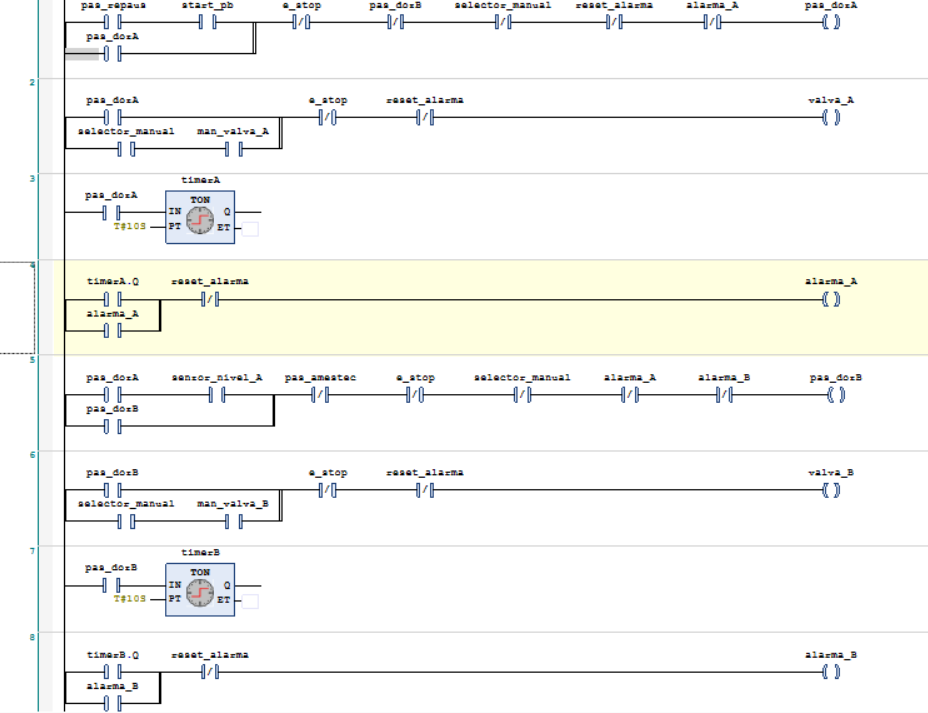
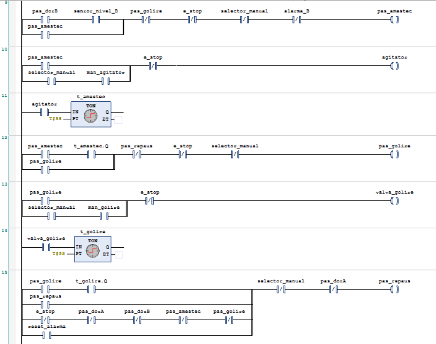

# Automated Dosing & Mixing Station (Ladder)

**🇷🇴 Română** · [**🇬🇧 For English, click here →**](#english)

---

## Descriere

Sistemul de comandă pentru o **stație automată de dozare și amestec** cu două
ingrediente, realizat în **Ladder Logic (LD)** în **CODESYS V3.5**. Instalația
dozează ingredientul A, apoi ingredientul B, le amestecă și golește vasul — un
ciclu automat complet. Proiectul a fost construit **incremental, pe patru
milestone-uri**, de la ciclul de bază până la oprire de avarie, regim manual și
un sistem de alarme cu watchdog — apropiat de cerințele reale dintr-o aplicație
industrială.

## Procesul (ciclul automat)

| Pas | Etapă | Ieșire activă | Condiție de avans |
|-----|-------|---------------|-------------------|
| `pas_repaus` | Repaus | — | `start_pb` apăsat |
| `pas_dozA` | Dozare A | `valva_A` | `senzor_nivel_A` atins |
| `pas_dozB` | Dozare B | `valva_B` | `senzor_nivel_B` atins |
| `pas_amestec` | Amestecare | `agitator` | `t_amestec` (5 s) |
| `pas_golire` | Golire | `valva_golire` | `t_golire` (5 s) → revine la Repaus |

## Intrări și ieșiri

**Intrări:** `start_pb`, `e_stop`, `senzor_nivel_A`, `senzor_nivel_B`,
`selector_manual`, `man_valva_A`, `man_valva_B`, `man_agitator`, `man_golire`,
`reset_alarma`
**Ieșiri:** `valva_A`, `valva_B`, `agitator`, `valva_golire`, `alarma_A`, `alarma_B`
**Memorie de pas:** `pas_repaus`, `pas_dozA`, `pas_dozB`, `pas_amestec`, `pas_golire`
**Temporizatoare (TON):** `timerA`, `timerB` (watchdog 10 s), `t_amestec` (5 s),
`t_golire` (5 s)

## Milestone-uri

### Milestone 1 — Ciclul automat de bază

Secvența celor cinci pași folosește câte o **variabilă de memorie** (`pas_*`) cu
**seal-in (latching)**. O singură etapă este activă la un moment dat, iar fiecare
dispozitiv este acționat doar în etapa care îl folosește. Avansul se face pe
**senzor** la dozare (`senzor_nivel_A`, `senzor_nivel_B`) și pe **temporizator** la
amestecare și golire; contactul **NC** al pasului următor închide pasul curent.

### Milestone 2 — Oprire de avarie (e_stop)

`e_stop` are **prioritate absolută**: apare ca **contact NC** în fiecare rung de
pas și de ieșire. La apăsare, toți pașii și toate ieșirile cad instant, indiferent
de etapă. Cât timp e apăsat, `start_pb` nu are efect (rung-ul `pas_dozA` cere
`/e_stop`). La eliberare, instalația nu reia ciclul întrerupt, ci ajunge într-o
**stare de repaus curată**, gata pentru un nou Start de la zero.

### Milestone 3 — Regim manual / automat

`selector_manual` dezactivează pașii automați (contact **NC** în rung-urile de
pas). Fiecare ieșire este comandată printr-o structură **OR mutual exclusivă**:
`ieșire = pas_automat SAU (selector_manual ȘI buton_manual)`. Astfel, o ieșire
primește comanda fie de la ciclul automat, fie de la butoanele manuale, niciodată
de la ambele. La comutarea între regimuri, pașii cad → **stare sigură**, fără
ieșiri „lipite". `e_stop` își păstrează prioritatea în ambele regimuri.

### Milestone 4 — Supraveghere și alarme

Un **watchdog** monitorizează durata dozării: `timerA` și `timerB` (TON, `PT =
T#10S`) rulează pe `pas_dozA`, respectiv `pas_dozB`. Dacă nivelul așteptat nu este
atins în 10 secunde, `timerX.Q` **declanșează alarma**. `alarma_A` / `alarma_B`
sunt **memorate (seal-in)** și rămân aprinse chiar dacă defectul dispare, până la
apăsarea `reset_alarma`. Contactul **NC** al alarmei blochează pasul respectiv și
repornirea ciclului. Watchdog-ul acționează **doar în regim automat**, fiindcă
temporizatoarele sunt alimentate din pașii automați.

## Concepte demonstrate

- **Mașină de stări secvențială** cu memorie de pas și seal-in
- **Prioritate de siguranță** (`e_stop`) prin contacte NC în cascadă peste întregul proces
- **Separare auto / manual** pe aceeași ieșire, prin structură OR mutual exclusivă
- **Watchdog cu TON** pentru detecția timeout-ului de proces (valvă blocată, rezervor gol)
- **Alarme memorate (latched)** cu confirmare/resetare manuală
- **Dezvoltare incrementală** structurată pe milestone-uri

## Cum îl rulezi

1. Deschide fișierul `.project` în **CODESYS V3.5**.
2. Selectează **Online → Simulation**, apoi **Login** și **Start**.
3. Lasă `selector_manual` pe FALSE (regim automat) și apasă `start_pb`.
4. Comută `senzor_nivel_A`, apoi `senzor_nivel_B` la momentul potrivit ca să
   avansezi dozarea; urmărește amestecarea (5 s) și golirea (5 s), apoi revenirea în repaus.
5. **Test avarie:** apasă `e_stop` în timpul ciclului — toate ieșirile cad.
6. **Test alarmă:** la dozarea A, nu activa `senzor_nivel_A` timp de 10 s — se
   aprinde `alarma_A`; confirmă cu `reset_alarma`.
7. **Test manual:** pune `selector_manual` pe TRUE și comandă direct valvele,
   agitatorul și golirea prin butoanele `man_*`.

## Construit cu

- CODESYS V3.5 (simulator integrat)
- Limbaj: Ladder Logic (LD)

---

# English version

[← Înapoi la română](#top)

## Description

The control system for an **automated dosing & mixing station** with two
ingredients, built in **Ladder Logic (LD)** in **CODESYS V3.5**. The plant doses
ingredient A, then ingredient B, mixes them, and drains the vessel — one full
automatic cycle. The project was built **incrementally, across four milestones**,
from the basic cycle up to an emergency stop, a manual/auto mode, and a watchdog
alarm system — close to the requirements of a real industrial application.

## The process (automatic cycle)

| Step | Phase | Active output | Advance condition |
|------|-------|---------------|-------------------|
| `pas_repaus` | Idle | — | `start_pb` pressed |
| `pas_dozA` | Dose A | `valva_A` | `senzor_nivel_A` reached |
| `pas_dozB` | Dose B | `valva_B` | `senzor_nivel_B` reached |
| `pas_amestec` | Mixing | `agitator` | `t_amestec` (5 s) |
| `pas_golire` | Draining | `valva_golire` | `t_golire` (5 s) → returns to Idle |

## Inputs and outputs

**Inputs:** `start_pb`, `e_stop`, `senzor_nivel_A`, `senzor_nivel_B`,
`selector_manual`, `man_valva_A`, `man_valva_B`, `man_agitator`, `man_golire`,
`reset_alarma`
**Outputs:** `valva_A`, `valva_B`, `agitator`, `valva_golire`, `alarma_A`, `alarma_B`
**Step memory:** `pas_repaus`, `pas_dozA`, `pas_dozB`, `pas_amestec`, `pas_golire`
**Timers (TON):** `timerA`, `timerB` (10 s watchdog), `t_amestec` (5 s), `t_golire` (5 s)

## Milestones

### Milestone 1 — Basic automatic cycle

The five-step sequence uses one **step-memory variable** (`pas_*`) each, with
**seal-in latching**. Only one phase is active at a time, and each device runs only
in the phase that uses it. The sequence advances on a **sensor** during dosing
(`senzor_nivel_A`, `senzor_nivel_B`) and on a **timer** during mixing and draining;
the **NC contact** of the next step closes the current one.

### Milestone 2 — Emergency stop (e_stop)

`e_stop` has **absolute priority**: it appears as an **NC contact** in every step
and every output rung. When pressed, all steps and all outputs drop instantly,
whatever the current phase. While held, `start_pb` has no effect (the `pas_dozA`
rung requires `/e_stop`). On release, the plant does not resume the interrupted
cycle — it settles into a **clean idle state**, ready for a fresh Start from zero.

### Milestone 3 — Manual / automatic mode

`selector_manual` disables the automatic steps (an **NC contact** in the step
rungs). Each output is driven by a **mutually exclusive OR** structure:
`output = auto_step OR (selector_manual AND manual_button)`. This way an output is
commanded either by the automatic cycle or by the manual buttons, never both. When
switching modes, the steps drop → a **safe state**, with no outputs left "stuck".
`e_stop` keeps its priority in both modes.

### Milestone 4 — Monitoring and alarms

A **watchdog** monitors the dosing duration: `timerA` and `timerB` (TON, `PT =
T#10S`) run on `pas_dozA` and `pas_dozB` respectively. If the expected level is not
reached within 10 seconds, `timerX.Q` **raises the alarm**. `alarma_A` / `alarma_B`
are **latched (seal-in)** and stay on even if the fault clears, until `reset_alarma`
is pressed. The alarm's **NC contact** blocks the affected step and any restart. The
watchdog acts **only in automatic mode**, since the timers are fed from the automatic
steps.

## Concepts demonstrated

- **Sequential state machine** with step memory and seal-in
- **Safety priority** (`e_stop`) via cascaded NC contacts across the whole process
- **Auto / manual separation** on the same output through a mutually exclusive OR structure
- **TON watchdog** for detecting process timeouts (stuck valve, empty tank)
- **Latched alarms** with manual acknowledge/reset
- **Incremental development** structured around milestones

## How to run it

1. Open the `.project` file in **CODESYS V3.5**.
2. Select **Online → Simulation**, then **Login** and **Start**.
3. Leave `selector_manual` at FALSE (automatic mode) and press `start_pb`.
4. Toggle `senzor_nivel_A`, then `senzor_nivel_B` at the right moment to advance
   dosing; watch the mixing (5 s) and draining (5 s), then the return to idle.
5. **Emergency test:** press `e_stop` mid-cycle — all outputs drop.
6. **Alarm test:** during dosing A, leave `senzor_nivel_A` inactive for 10 s —
   `alarma_A` lights up; acknowledge with `reset_alarma`.
7. **Manual test:** set `selector_manual` to TRUE and command the valves, agitator,
   and drain directly via the `man_*` buttons.

## Built with

- CODESYS V3.5 (built-in simulator)
- Language: Ladder Logic (LD)
