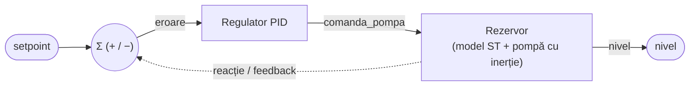
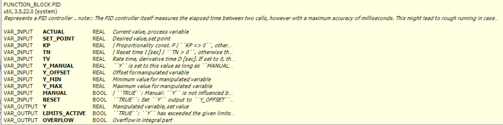
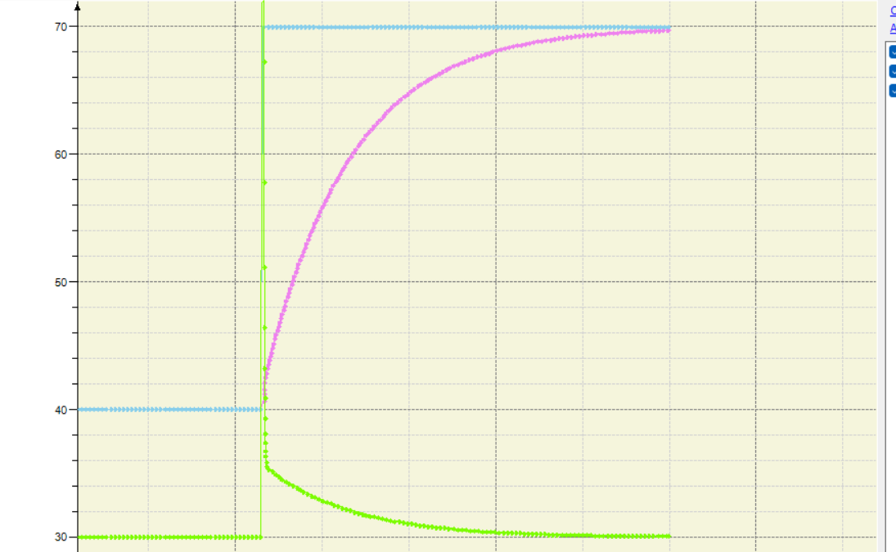
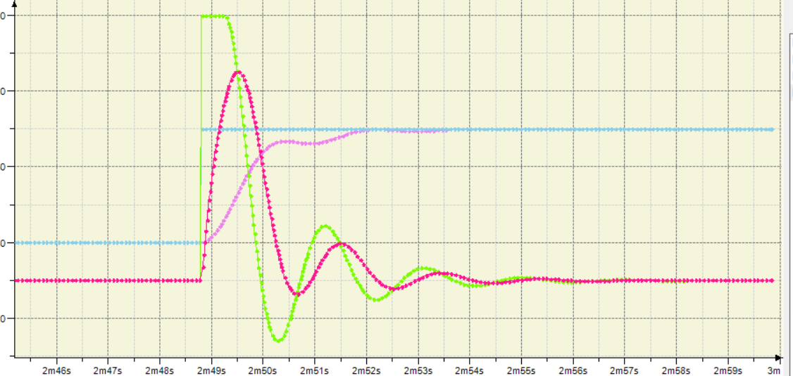
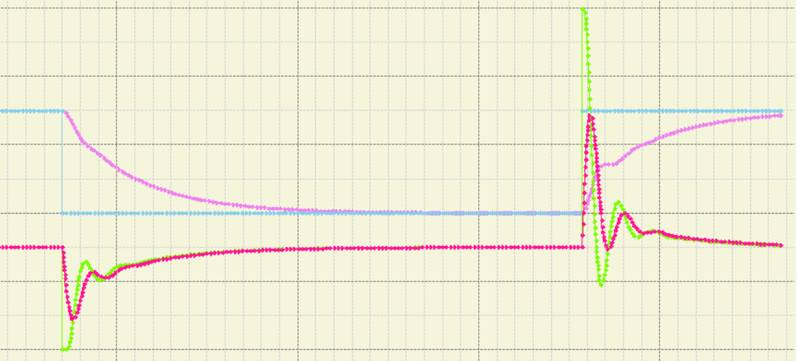
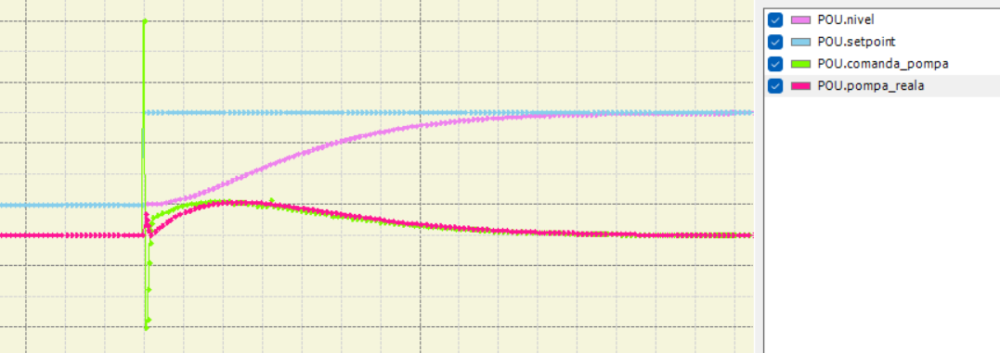
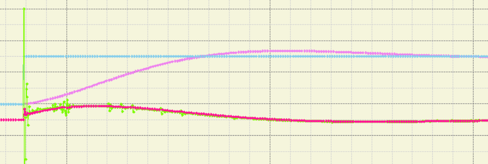
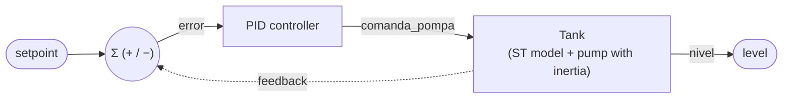

# Reglarea automată a nivelului într-un rezervor — regulator PID (CODESYS)
### Automatic tank level control — PID controller (CODESYS)

Sistem de reglare în buclă închisă care menține nivelul de lichid dintr-un rezervor la o valoare dorită, folosind blocul PID din biblioteca standard CODESYS. Procesul fizic este simulat printr-un model matematic scris în Structured Text, astfel încât regulatorul acționează asupra unui proces care reacționează realist la comandă. Proiectul include acordarea empirică a parametrilor și analiza răspunsului pe Trace.

*Closed-loop control system that keeps the liquid level in a tank at a desired value, using the standard CODESYS PID block. The physical process is simulated by a math model written in Structured Text, so the controller acts on a process that reacts realistically to the command. The project includes empirical tuning and step-response analysis on Trace.*

---

**🌐 Limbă / Language:** [Română](#-română) · [English](#-english)

---

## 🇷🇴 Română

- [Descriere](#descriere)
- [Schema buclei de reglare](#schema-buclei-de-reglare)
- [Structura proiectului](#structura-proiectului)
- [Variabile (I/O)](#variabile-io)
- [Modelul de proces](#modelul-de-proces-structured-text)
- [Regulatorul PID](#regulatorul-pid)
- [Cum funcționează](#cum-funcționează)
- [Experimente și rezultate](#experimente-și-rezultate)
- [Acordarea finală](#acordarea-finală)
- [Concepte demonstrate](#concepte-demonstrate)
- [Cum se rulează](#cum-se-rulează)
- [Realizat cu](#realizat-cu)

### Descriere

Instalația simulată constă într-un rezervor alimentat de o pompă a cărei turație poate fi comandată continuu, între 0 și 100%, și care are o scurgere (consum) constantă la ieșire. Un traductor măsoară nivelul, exprimat între 0 și 100%. Regulatorul PID compară nivelul măsurat cu nivelul dorit (setpoint) și ajustează automat turația pompei: dacă nivelul este sub setpoint, pompa accelerează; dacă este peste, încetinește, până când nivelul se stabilizează la valoarea dorită.

Bucla este închisă: comanda regulatorului intră în modelul procesului, modelul calculează noul nivel, iar nivelul se întoarce ca reacție la intrarea regulatorului. Pentru un comportament realist, pompa este modelată cu inerție — turația reală urmărește treptat comanda, nu instantaneu — ceea ce introduce întârzierea necesară pentru a studia suprareglajul.

### Schema buclei de reglare



Eroarea = `setpoint − nivel`. Regulatorul transformă eroarea în comandă pentru pompă; modelul calculează noul nivel; nivelul se întoarce la comparator și ciclul se reia în fiecare scan.

### Structura proiectului

| Obiect | Limbaj | Rol |
|---|---|---|
| `Reglare_PID` (POU) | Structured Text | Conține modelul rezervorului **și** apelul blocului PID (bucla închisă) |
| `PLC_PRG` | ST / Ladder | Apelează ciclic `Reglare_PID();` |
| `Trace` | — | Înregistrează și afișează grafic `nivel`, `setpoint`, `comanda_pompa`, `pompa_reala` |

### Variabile (I/O)

| Variabilă | Tip | Rol |
|---|---|---|
| `setpoint` | `REAL` | Nivelul dorit (intrare de la operator) |
| `nivel` | `REAL` | Nivelul măsurat — valoarea de proces (PV), calculată de model |
| `comanda_pompa` | `REAL` | Ieșirea PID, comanda către pompă (0–100 %) |
| `pompa_reala` | `REAL` | Turația reală a pompei (urmărește comanda cu întârziere) |
| `regulator` | `PID` | Instanța blocului PID (biblioteca `util`) |
| `kp` | `REAL` | Câștig proporțional (P) |
| `tn` | `REAL` | Timp integral (I) [s] — *mic = integrare puternică* |
| `tv` | `REAL` | Timp derivativ (D) [s] — *0 = fără D* |

### Modelul de proces (Structured Text)

Modelul simulează dinamica rezervorului. Pompa are inerție (nu ajunge instant la turația cerută), iar nivelul crește proporțional cu turația reală și scade cu o rată de scurgere constantă, fiind limitat între 0 și 100 %.

```iecst
// pompa cu inerție — introduce întârzierea de proces necesară pentru a studia suprareglajul
pompa_reala := pompa_reala + (comanda_pompa - pompa_reala) * 0.05;

// dinamica nivelului: aport de la pompă − scurgere constantă, limitat la 0..100 %
nivel := nivel + (pompa_reala * 0.01) - 0.3;
IF nivel > 100.0 THEN nivel := 100.0; END_IF
IF nivel < 0.0   THEN nivel := 0.0;   END_IF
```

### Regulatorul PID

Se folosește blocul `PID` din biblioteca `util`. Ieșirea este limitată la 0–100 % (`Y_MIN`/`Y_MAX`), ceea ce asigură anti-saturația comenzii către pompă.

```iecst
regulator(
    ACTUAL    := nivel,
    SET_POINT := setpoint,
    KP        := kp,
    TN        := tn,
    TV        := tv,
    Y_MANUAL  := 0.0,
    Y_OFFSET  := 0.0,
    Y_MIN     := 0.0,
    Y_MAX     := 100.0,
    MANUAL    := FALSE,
    RESET     := FALSE
);
comanda_pompa := regulator.Y;
```

Pinii blocului `PID` din biblioteca `util`:



### Cum funcționează

1. `PLC_PRG` apelează `Reglare_PID()` în fiecare scan.
2. În `Reglare_PID`, întâi se execută modelul rezervorului (se recalculează `nivel`), apoi se apelează blocul `PID`.
3. Regulatorul compară `nivel` cu `setpoint`, calculează comanda și o scrie în `comanda_pompa` (limitată 0–100 %).
4. La scanul următor, `comanda_pompa` alimentează modelul prin `pompa_reala`, care modifică din nou `nivel` — bucla se închide.
5. Analiza se face pe `Trace`, folosind răspunsul la treaptă (schimbarea `setpoint`-ului între două valori și observarea evoluției).

### Experimente și rezultate

Toate observațiile de mai jos au fost obținute experimental, pe `Trace`, variind câte un singur parametru și aplicând trepte de setpoint.

**1. Saturația comenzii (KP mare).** La `KP = 30`, la o treaptă mare de setpoint comanda saturează instant la capătul intervalului (0 sau 100 %). În regimul de saturație, valoarea lui KP nu mai influențează răspunsul — pompa este deja la limită. Se observă spike-ul de comandă (verde) urmat de coborârea lină pe măsură ce nivelul se apropie de țintă.



**2. Suprareglaj din întârzierea de proces (I agresiv + inerția pompei).** Cu `KP = 10`, `TN = 1` (integrare puternică) și pompa modelată cu inerție, nivelul (roz) **depășește** setpoint-ul și revine cu oscilații amortizate. Concluzie cheie: suprareglajul provine din întârzierea procesului (pompa reală rămâne în urma comenzii), nu din regulator în sine.



**3. Acord echilibrat (`KP = 10`, `TN = 4`).** Slăbind integrala (mărind `TN` de la 1 la 4), suprareglajul dispare: nivelul ajunge la setpoint rapid și fără să-l depășească, în ambele sensuri (coborâre 70→40 și urcare 40→70).



**4. Efectul termenului derivativ (`TV = 1`).** Adăugarea unui derivativ moderat calmează oscilațiile din comandă și netezește efortul de reglare, fără a încetini reacția — se obține „ce e mai bun din ambele": viteza de la I și netezimea de la D.



**5. Limita superioară a lui D (`TV = 3`).** Un derivativ excesiv face comanda „țepoasă" — amplifică orice mică variație, producând vârfuri nervoase. Demonstrează de ce D-ul se aplică cu moderație (și, în practică, de ce este adesea lăsat la 0 în prezența zgomotului de senzor).



### Acordarea finală

| Parametru | Valoare | Observație |
|---|---|---|
| `KP` | 10 | Viteză bună de reacție, fără instabilitate |
| `TN` | 4 | Elimină eroarea staționară fără suprareglaj |
| `TV` | 0 (PI) / 1 (PID) | `0` → regulator **PI**, robust și simplu; `1` → PID, comandă mai netedă |

Setarea recomandată pentru acest proces este un **PI** (`KP = 10`, `TN = 4`, `TV = 0`) — simplu și robust, configurația cea mai folosită în practică pentru control de nivel. Varianta PID (`TV = 1`) oferă o comandă puțin mai netedă.

### Concepte demonstrate

- Reglare în buclă închisă (setpoint / PV / eroare / comandă / reacție)
- Simularea unui proces prin model matematic în Structured Text
- Utilizarea unui bloc PID de bibliotecă și limitarea comenzii (anti-saturație)
- Analiza răspunsului la treaptă pe `Trace`
- Acordarea empirică a parametrilor și rolul fiecărui termen: **P** (viteză), **I** (eroare staționară), **D** (amortizarea oscilațiilor)
- Familia de regulatoare P / PI / PID și când se folosește fiecare
- Efectul întârzierii de proces asupra apariției suprareglajului

### Cum se rulează

1. Se deschide proiectul în **CODESYS V3.5** cu device-ul **CODESYS Control Win V3** (PLC soft).
2. `Online → Simulation`, apoi `Login` și `Start` (nu este nevoie de hardware).
3. Se deschide obiectul `Trace` și se pornește (`Download Trace`).
4. Se schimbă `setpoint` (ex. 40 → 70) și se observă răspunsul pe grafic.
5. Se pot modifica `kp`, `tn`, `tv` din lista de monitorizare (`watch`) pentru a reproduce experimentele.

### Realizat cu

- **CODESYS V3.5** (cu simulator integrat)
- Biblioteca **`util`** (blocul `PID`)
- **Structured Text (IEC 61131-3)** — model de proces
- Unealta **Trace** — analiza răspunsului

---

## 🇬🇧 English

- [Overview](#overview)
- [Control loop diagram](#control-loop-diagram)
- [Project structure](#project-structure)
- [Variables (I/O)](#variables-io)
- [Process model](#process-model-structured-text)
- [PID controller](#pid-controller)
- [How it works](#how-it-works)
- [Experiments and results](#experiments-and-results)
- [Final tuning](#final-tuning)
- [Concepts demonstrated](#concepts-demonstrated)
- [How to run](#how-to-run)
- [Built with](#built-with)

### Overview

The simulated plant is a tank fed by a pump whose speed can be commanded continuously between 0 and 100 %, with a constant outflow (consumption). A transmitter measures the level, expressed between 0 and 100 %. The PID controller compares the measured level with the desired value (setpoint) and automatically adjusts the pump speed: if the level is below setpoint, the pump speeds up; if above, it slows down, until the level settles at the target.

The loop is closed: the controller command feeds the process model, the model computes the new level, and the level returns as feedback to the controller input. For realistic behaviour, the pump is modelled with inertia — actual speed tracks the command gradually, not instantly — which introduces the delay needed to study overshoot.

### Control loop diagram



Error = `setpoint − level`. The controller turns the error into a pump command; the model computes the new level; the level returns to the comparator and the cycle repeats every scan.

### Project structure

| Object | Language | Role |
|---|---|---|
| `Reglare_PID` (POU) | Structured Text | Holds the tank model **and** the PID call (closed loop) |
| `PLC_PRG` | ST / Ladder | Calls `Reglare_PID();` cyclically |
| `Trace` | — | Records and plots `nivel`, `setpoint`, `comanda_pompa`, `pompa_reala` |

### Variables (I/O)

| Variable | Type | Role |
|---|---|---|
| `setpoint` | `REAL` | Desired level (operator input) |
| `nivel` | `REAL` | Measured level — process value (PV), computed by the model |
| `comanda_pompa` | `REAL` | PID output, pump command (0–100 %) |
| `pompa_reala` | `REAL` | Actual pump speed (tracks the command with delay) |
| `regulator` | `PID` | PID block instance (`util` library) |
| `kp` | `REAL` | Proportional gain (P) |
| `tn` | `REAL` | Integral time (I) [s] — *small = strong integral action* |
| `tv` | `REAL` | Derivative time (D) [s] — *0 = no D* |

### Process model (Structured Text)

The model simulates the tank dynamics. The pump has inertia (it does not reach the requested speed instantly), and the level rises proportionally to the actual speed and falls with a constant leak rate, clamped between 0 and 100 %.

```iecst
// pump with inertia — introduces the process delay needed to study overshoot
pompa_reala := pompa_reala + (comanda_pompa - pompa_reala) * 0.05;

// level dynamics: pump inflow − constant leak, clamped to 0..100 %
nivel := nivel + (pompa_reala * 0.01) - 0.3;
IF nivel > 100.0 THEN nivel := 100.0; END_IF
IF nivel < 0.0   THEN nivel := 0.0;   END_IF
```

### PID controller

The `PID` block from the `util` library is used. The output is limited to 0–100 % (`Y_MIN`/`Y_MAX`), which provides command anti-saturation towards the pump.

```iecst
regulator(
    ACTUAL    := nivel,
    SET_POINT := setpoint,
    KP        := kp,
    TN        := tn,
    TV        := tv,
    Y_MANUAL  := 0.0,
    Y_OFFSET  := 0.0,
    Y_MIN     := 0.0,
    Y_MAX     := 100.0,
    MANUAL    := FALSE,
    RESET     := FALSE
);
comanda_pompa := regulator.Y;
```

Pins of the `PID` block from the `util` library:


### How it works

1. `PLC_PRG` calls `Reglare_PID()` every scan.
2. Inside `Reglare_PID`, the tank model runs first (recomputing `nivel`), then the `PID` block is called.
3. The controller compares `nivel` with `setpoint`, computes the command and writes it to `comanda_pompa` (limited to 0–100 %).
4. On the next scan, `comanda_pompa` feeds the model through `pompa_reala`, which changes `nivel` again — the loop is closed.
5. Analysis is done on `Trace`, using the step response (changing `setpoint` between two values and observing the evolution).

### Experiments and results

All observations below were obtained experimentally on `Trace`, varying a single parameter at a time and applying setpoint steps.

**1. Command saturation (large KP).** At `KP = 30`, for a large setpoint step the command saturates instantly at the range limit (0 or 100 %). While saturated, the value of KP no longer affects the response — the pump is already at its limit. The command spike (green) is followed by a smooth decrease as the level approaches the target.


**2. Overshoot from process delay (aggressive I + pump inertia).** With `KP = 10`, `TN = 1` (strong integral) and the pump modelled with inertia, the level (pink) **overshoots** the setpoint and returns with damped oscillations. Key takeaway: overshoot comes from the process delay (the real pump lags the command), not from the controller itself.


**3. Balanced tuning (`KP = 10`, `TN = 4`).** Weakening the integral (raising `TN` from 1 to 4) removes the overshoot: the level reaches setpoint quickly and without exceeding it, in both directions (down 70→40 and up 40→70).


**4. Effect of the derivative term (`TV = 1`).** Adding a moderate derivative calms the oscillations in the command and smooths the control effort, without slowing the response — achieving "the best of both": the speed from I and the smoothness from D.


**5. Upper limit of D (`TV = 3`).** An excessive derivative makes the command "spiky" — it amplifies any small variation, producing nervous peaks. This shows why D is applied with moderation (and, in practice, why it is often left at 0 in the presence of sensor noise).


### Final tuning

| Parameter | Value | Note |
|---|---|---|
| `KP` | 10 | Good response speed, no instability |
| `TN` | 4 | Removes steady-state error without overshoot |
| `TV` | 0 (PI) / 1 (PID) | `0` → **PI** controller, robust and simple; `1` → PID, smoother command |

The recommended setting for this process is a **PI** controller (`KP = 10`, `TN = 4`, `TV = 0`) — simple and robust, the most common configuration in practice for level control. The PID variant (`TV = 1`) offers a slightly smoother command.

### Concepts demonstrated

- Closed-loop control (setpoint / PV / error / command / feedback)
- Simulating a process with a math model in Structured Text
- Using a library PID block and limiting the command (anti-saturation)
- Step-response analysis on `Trace`
- Empirical parameter tuning and the role of each term: **P** (speed), **I** (steady-state error), **D** (oscillation damping)
- The P / PI / PID controller family and when to use each
- The effect of process delay on the appearance of overshoot

### How to run

1. Open the project in **CODESYS V3.5** with the **CODESYS Control Win V3** device (soft PLC).
2. `Online → Simulation`, then `Login` and `Start` (no hardware required).
3. Open the `Trace` object and start it (`Download Trace`).
4. Change `setpoint` (e.g. 40 → 70) and watch the response on the graph.
5. Modify `kp`, `tn`, `tv` from the watch list to reproduce the experiments.

### Built with

- **CODESYS V3.5** (with built-in simulator)
- The **`util`** library (`PID` block)
- **Structured Text (IEC 61131-3)** — process model
- The **Trace** tool — response analysis
