# Proiectarea și simularea unui regulator digital PI pentru o centrală termică

Proiect personal de Automatică / Ingineria Reglării Automate realizat **de la modelarea procesului până la validarea finală în Python**.

Scopul proiectului este proiectarea, implementarea numerică și testarea unui regulator pentru temperatura unei încăperi încălzite de o centrală termică. Proiectul este realizat **exclusiv în simulare**, fără hardware real, și urmărește întregul proces inginereasc: modelare, analiză, alegerea structurii de reglare, simulare, discretizare, tratarea limitărilor reale, optimizare, robustețe și validare statistică.

> **Important:** valorile parametrilor termici folosite aici sunt parametri de model adoptați pentru proiect, nu rezultate ale unei identificări experimentale pe o clădire reală. Prin urmare, proiectul demonstrează metodologia de proiectare și validare a unui regulator, nu certifică un regulator gata de instalare pe o centrală reală.

---

## Cuprins

- [1. Obiectivul proiectului](#1-obiectivul-proiectului)
- [2. Schema bloc și semnalele sistemului](#2-schema-bloc-și-semnalele-sistemului)
- [3. Modelarea procesului termic](#3-modelarea-procesului-termic)
- [4. De la regulator P la regulator PI](#4-de-la-regulator-p-la-regulator-pi)
- [5. Saturația actuatorului și anti-windup](#5-saturația-actuatorului-și-anti-windup)
- [6. Dinamica centralei, timpul mort și verificarea stabilității](#6-dinamica-centralei-timpul-mort-și-verificarea-stabilității)
- [7. Trecerea la regulator numeric](#7-trecerea-la-regulator-numeric)
- [8. Senzor digital: cuantizare, zgomot și filtrare](#8-senzor-digital-cuantizare-zgomot-și-filtrare)
- [9. Criteriile de performanță](#9-criteriile-de-performanță)
- [10. Prima căutare automată și de ce nu a funcționat](#10-prima-căutare-automată-și-de-ce-nu-a-funcționat)
- [11. Compensarea temperaturii exterioare - feedforward](#11-compensarea-temperaturii-exterioare---feedforward)
- [12. Încercarea cu două grade de libertate](#12-încercarea-cu-două-grade-de-libertate)
- [13. Identificarea limitei fizice și corectarea metodologiei](#13-identificarea-limitei-fizice-și-corectarea-metodologiei)
- [14. Regulatorul final](#14-regulatorul-final)
- [15. Validarea nominală](#15-validarea-nominală)
- [16. Analiza de robustețe](#16-analiza-de-robustețe)
- [17. Monte Carlo pentru zgomotul senzorului](#17-monte-carlo-pentru-zgomotul-senzorului)
- [18. Cum se rulează proiectul](#18-cum-se-rulează-proiectul)

---

# 1. Obiectivul proiectului

Problema aleasă este reglarea temperaturii unei încăperi folosind o centrală termică.

Sistemul trebuie să:

- urmărească o temperatură de referință;
- elimine sau să reducă eroarea staționară;
- respingă o perturbare produsă de scăderea temperaturii exterioare;
- respecte limita de putere a centralei;
- evite efectul de `integrator windup`;
- funcționeze ca regulator numeric, cu perioadă de eșantionare finită;
- țină cont de zgomotul și cuantizarea senzorului;
- rămână funcțional când modelul real diferă de modelul nominal.

Procesul de lucru a fost intenționat construit incremental. Nu s-a pornit direct de la un regulator final, ci de la întrebările de bază:

1. Care este intrarea procesului?
2. Care este ieșirea?
3. Ce reprezintă eroarea?
4. Cum se modelează pierderile de căldură?
5. Cum se obține funcția de transfer?
6. Ce regulator este necesar?
7. Ce se întâmplă când actuatorul se saturează?
8. Cum se implementează regulatorul într-un calculator?
9. Ce se întâmplă în prezența zgomotului și a incertitudinilor?

Această abordare urmează ideea clasică de proiectare iterativă a unui sistem de reglare: **modelare → analiză → proiectare → simulare → testare → corectare**.

---

# 2. Schema bloc și semnalele sistemului

În forma finală, sistemul conține o buclă de reacție PI și o compensare feedforward a temperaturii exterioare.

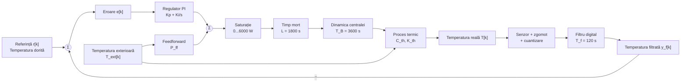
```mermaid
flowchart LR
    R["Referință r[k]<br/>Temperatura dorită"] --> SUM((Σ))
    YF["Temperatura filtrată y_f[k]"] -->|−| SUM
    SUM --> E["Eroare e[k]"]
    E --> PI["Regulator PI<br/>Kp + Ki/s"]

    TEXT["Temperatura exterioară<br/>T_ext[k]"] --> FF["Feedforward<br/>P_ff"]
    PI --> CMD((Σ))
    FF --> CMD
    CMD --> SAT["Saturație<br/>0...6000 W"]
    SAT --> DELAY["Timp mort<br/>L = 1800 s"]
    DELAY --> BOILER["Dinamica centralei<br/>T_B = 3600 s"]
    BOILER --> ROOM["Proces termic<br/>C_th, K_th"]
    TEXT --> ROOM
    ROOM --> T["Temperatura reală T[k]"]
    T --> SENSOR["Senzor + zgomot<br/>+ cuantizare"]
    SENSOR --> FILTER["Filtru digital<br/>T_f = 120 s"]
    FILTER --> YF
```

Semnalele principale sunt:

| Simbol | Semnificație |
|---|---|
| `r` | temperatura de referință |
| `T`, `y` | temperatura reală / mărimea reglată |
| `e = r - y` | eroarea de reglare |
| `P_cmd` | puterea comandată de regulator |
| `P` | puterea efectivă livrată după dinamica centralei |
| `T_ext` | temperatura exterioară, tratată ca perturbare măsurabilă |
| `P_ff` | compensarea feedforward a pierderilor suplimentare |
| `n` | zgomot de măsurare |

Pentru această aplicație, reacția este negativă: dacă temperatura măsurată este sub referință, eroarea este pozitivă și regulatorul cere o putere mai mare.

---

# 3. Modelarea procesului termic

## 3.1 Bilanțul termic

Modelul încăperii a fost construit pornind de la conservarea energiei:

$$
C_{th}\frac{dT}{dt} = P - K_{th}(T-T_{ext})
$$

unde:

- $C_{th}$ este capacitatea termică echivalentă a încăperii;
- $K_{th}$ este coeficientul global al pierderilor termice;
- $P$ este puterea termică furnizată;
- $T$ este temperatura interioară;
- $T_{ext}$ este temperatura exterioară.

Parametrii nominali adoptați în proiect sunt:

| Parametru | Valoare | Unitate |
|---|---:|---|
| $C_{th}$ | 5 000 000 | J/°C |
| $K_{th}$ | 250 | W/°C |

Coeficientul $K_{th}$ este introdus deoarece pierderea termică crește odată cu diferența dintre temperatura interioară și cea exterioară. Fără acest termen, un aport constant de putere ar produce o creștere nerealistă și nelimitată a temperaturii.

## 3.2 Funcția de transfer a încăperii

Pentru variații în jurul unui punct de funcționare și considerând separat perturbarea $T_{ext}$, modelul putere → temperatură devine:

$$
G_{th}(s)=\frac{1}{C_{th}s+K_{th}}
$$

sau, în formă standard:

$$
G_{th}(s)=\frac{1/K_{th}}{(C_{th}/K_{th})s+1}
$$

Rezultă:

$$
K=\frac{1}{K_{th}}=0.004\ ^\circ C/W
$$

și:

$$
\tau=\frac{C_{th}}{K_{th}}=20000\ s\approx5.56\ h
$$

prin urmare:

$$
\boxed{G_{th}(s)=\frac{0.004}{20000s+1}}
$$

Constanta de timp foarte mare arată că avem un **proces lent**.

## 3.3 Răspunsul la treaptă

Primul test a fost răspunsul procesului termic la o treaptă de putere și efectul modificării constantei de timp.

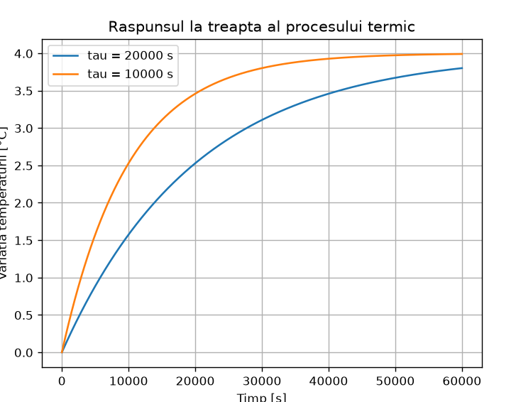

Graficul confirmă proprietatea unui element de ordinul I: modificarea lui $\tau$ schimbă în principal **viteza** cu care sistemul ajunge la noul regim staționar, nu valoarea finală determinată de câștigul static.

---

# 4. De la regulator P la regulator PI

## 4.1 Regulator proporțional

Prima structură testată a fost regulatorul P:

$$
u(t)=K_p e(t)
$$

Creșterea lui $K_p$ produce o acțiune mai puternică pentru aceeași eroare. În simulări s-a observat că un câștig mai mare poate reduce abaterea și accelera răspunsul, dar nu elimină în general eroarea staționară și poate deteriora amortizarea.

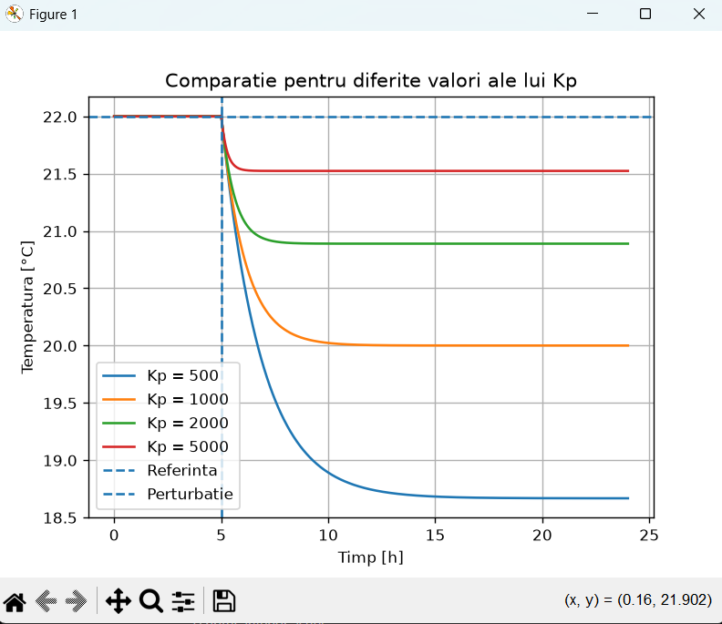

Acesta a fost motivul trecerii la un regulator PI.

## 4.2 Regulator PI

Legea continuă folosită este:

$$
u(t)=K_p e(t)+K_i\int e(t)dt
$$

cu:

$$
K_i=\frac{K_p}{T_i}
$$

Componenta proporțională reacționează la eroarea curentă, iar componenta integrală acumulează eroarea în timp și poate elimina abaterea staționară.

În proiect a fost păstrată relația:

$$
T_i=20000\ s
$$

adică o valoare de ordinul constantei de timp a procesului termic.

---

# 5. Saturația actuatorului și anti-windup

O centrală reală nu poate furniza putere nelimitată. În model s-a impus:

$$
0\le P_{cmd}\le6000\ W
$$

Aici apare o problemă specifică regulatoarelor cu integrator. Dacă regulatorul cere, de exemplu, 8000 W, actuatorul livrează în continuare doar 6000 W, dar integratorul poate continua să acumuleze eroarea. Când temperatura ajunge ulterior la referință, integratorul poate rămâne foarte încărcat și menține comanda excesivă, producând suprareglaj mare și recuperare lentă.

Acesta este fenomenul de **integrator windup**.

A fost testat direct efectul lui:

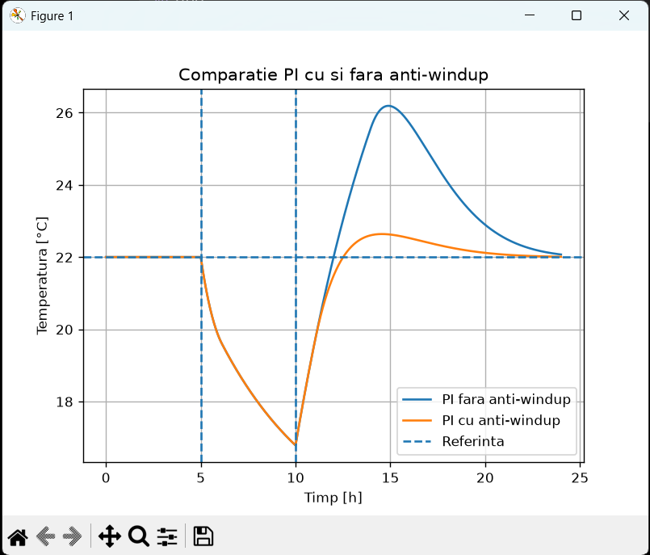

În implementarea finală se folosește **conditional integration**. Integratorul este blocat numai dacă:

- comanda depășește $P_{max}$ și eroarea este pozitivă;
- comanda scade sub $P_{min}$ și eroarea este negativă.

Altfel, integrarea continuă normal.

Conceptual:

```text
if P_candidate > Pmax and e > 0:
    nu integra
elif P_candidate < Pmin and e < 0:
    nu integra
else:
    xI = xI + Te * e
```

---

# 6. Dinamica centralei, timpul mort și verificarea stabilității

Modelul inițial al încăperii a fost apoi completat cu dinamica centralei.

## 6.1 Dinamica centralei

Centrala este modelată ca un element de ordinul I:

$$
G_B(s)=\frac{1}{T_Bs+1}
$$

cu:

$$
T_B=3600\ s
$$

## 6.2 Timpul mort

A fost introdus un timp mort:

$$
L=1800\ s=30\ min
$$

care reprezintă întârzierea dintre modificarea comenzii și efectul termic observabil.

În modelul continuu, forma compactă a procesului este aproximativ:

$$
\boxed{
G_P(s)=
\frac{0.004e^{-1800s}}
{(20000s+1)(3600s+1)}
}
$$

Timpul mort are un efect important asupra stabilității și asupra posibilității de a crește agresiv câștigul regulatorului.

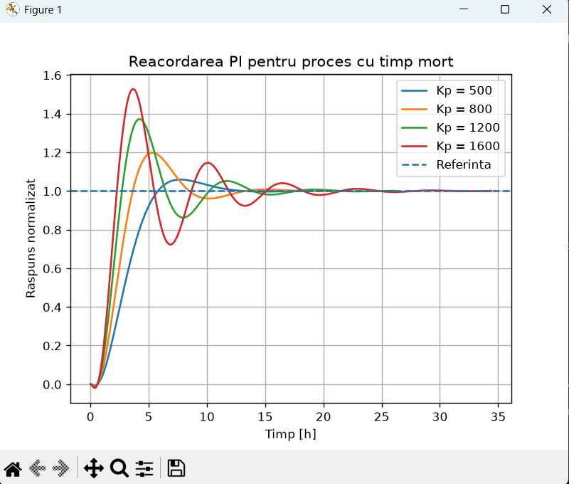

## 6.3 Analiza în frecvență

Înainte de introducerea tuturor neliniarităților și a implementării discrete s-a făcut și o verificare în frecvență pe modelul simplificat.

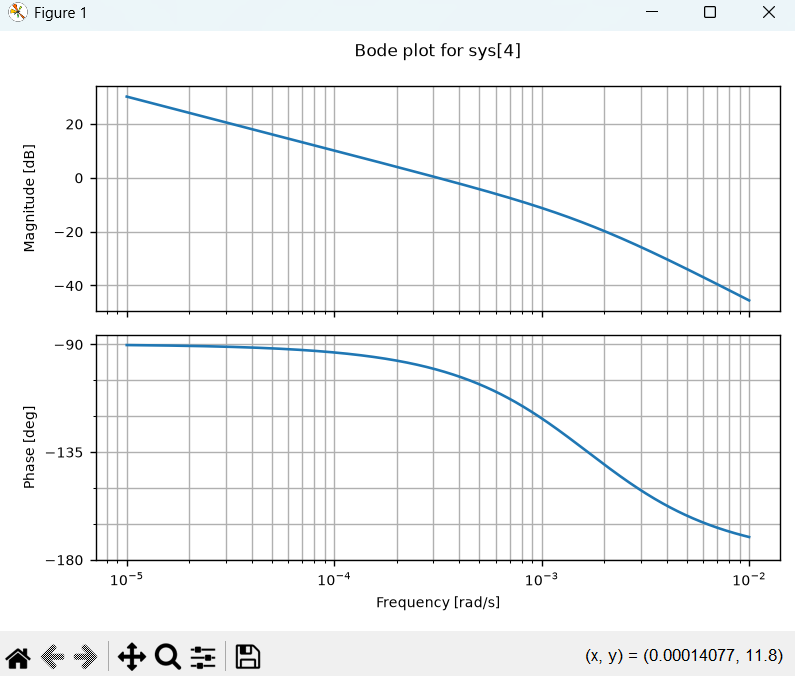

Pentru una dintre configurațiile PI analizate în această etapă au rezultat:

- gain margin: `∞`;
- phase margin: `90°`;
- frecvență de tăiere aproximativă: `0.00032 rad/s`.

Acest test a fost folosit ca verificare intermediară; modelul final conține suplimentar saturație, timp mort, senzor digital, zgomot și feedforward și este evaluat în principal prin simulare numerică în timp.

---

# 7. Trecerea la regulator numeric

Proiectul final este destinat implementării pe calculator, deci regulatorul continuu trebuie transformat într-un algoritm care lucrează la momente discrete.

## 7.1 De ce este necesară discretizarea

Calculatorul nu măsoară și nu recalculează comanda la fiecare moment continuu. El execută periodic:

1. citește senzorul;
2. calculează eroarea;
3. actualizează integratorul;
4. calculează comanda;
5. păstrează comanda până la următorul eșantion.

În forma discretă:

$$
e[k]=r[k]-y_f[k]
$$

$$
x_I[k+1]=x_I[k]+T_e e[k]
$$

$$
u[k]=K_pe[k]+K_ix_I[k]
$$

## 7.2 Alegerea perioadei de eșantionare

Au fost comparate mai multe perioade de eșantionare.

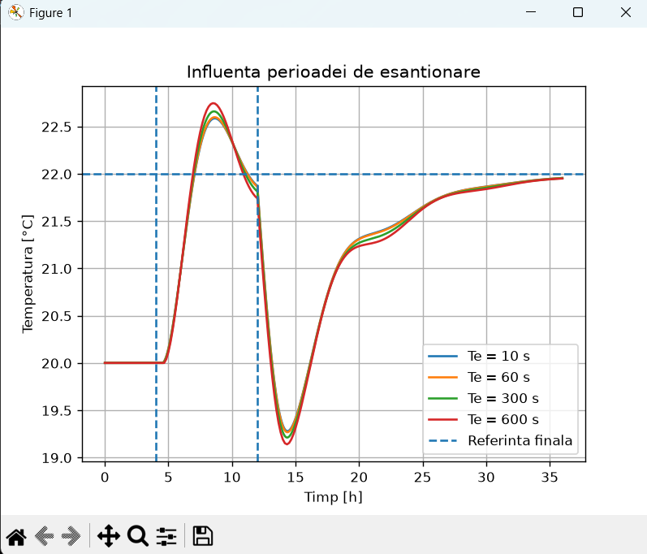

Pentru proiect s-a ales:

$$
\boxed{T_e=60\ s}
$$

Raportat la dinamica procesului:

$$
\frac{T_B}{T_e}=60
$$

și:

$$
\frac{L}{T_e}=30
$$

Astfel, dinamica centralei este descrisă cu suficient de multe eșantioane, iar timpul mort nominal este reprezentat exact printr-un buffer de 30 de eșantioane.

## 7.3 Verificarea polilor în discret

A fost verificată și poziția polilor sistemului discret în raport cu cercul unitate.

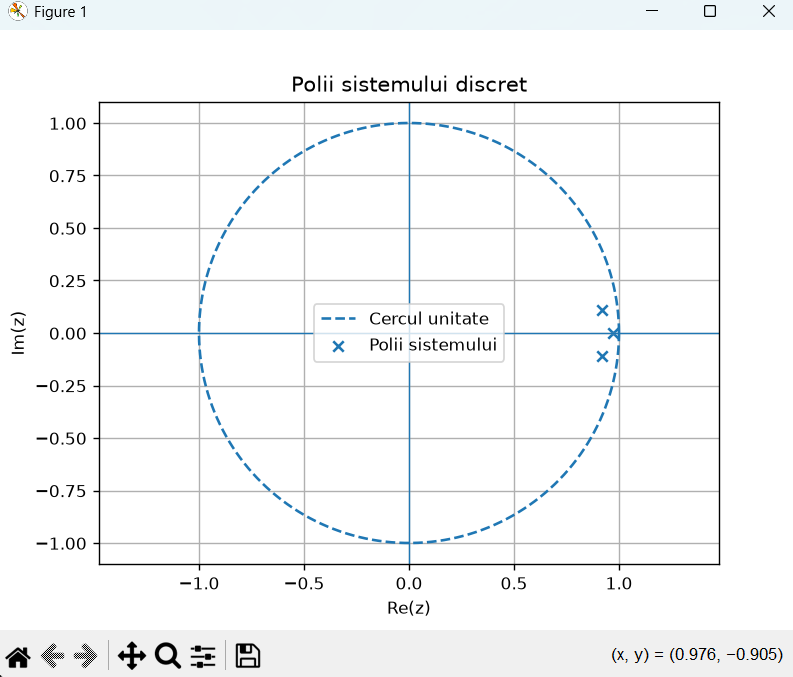

Acesta a fost un control suplimentar înainte de trecerea la simularea completă cu neliniarități și zgomot.

---

# 8. Senzor digital: cuantizare, zgomot și filtrare

Un senzor real nu furnizează exact temperatura procesului.

Modelul final include:

- zgomot gaussian de măsurare;
- cuantizare;
- filtrare digitală.

## 8.1 Cuantizare

Pasul de cuantizare ales este:

$$
\boxed{q=0.1^\circ C}
$$

Au fost comparate mai multe rezoluții pentru a vedea influența cuantizării asupra răspunsului.

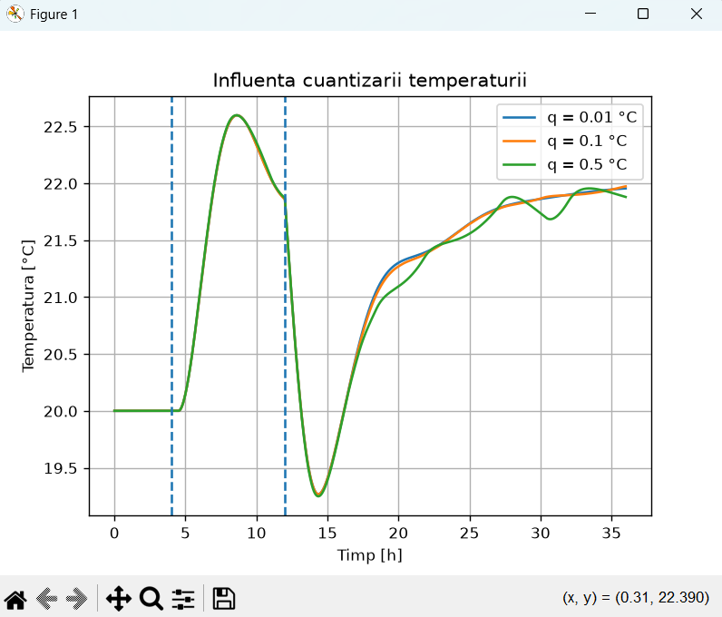

Cuantizarea este implementată prin rotunjire:

```python
y_q = round(y / q) * q
```

## 8.2 Zgomotul senzorului

Zgomotul este modelat cu:

$$
n\sim\mathcal{N}(0,\sigma^2)
$$

unde:

$$
\boxed{\sigma=0.2^\circ C}
$$

Fără filtrare, zgomotul de temperatură produce variații vizibile ale comenzii regulatorului.

## 8.3 Filtrul digital

A fost introdus un filtru trece-jos discret de ordinul I:

$$
y_f[k]=\alpha y_f[k-1]+(1-\alpha)y_q[k]
$$

cu:

$$
\alpha=\frac{T_f}{T_f+T_e}
$$

În configurația finală:

$$
T_f=120\ s, \qquad T_e=60\ s
$$

și deci:

$$
\alpha=\frac{120}{180}=0.6667
$$

Au fost testate mai multe valori pentru $T_f$, urmărind compromisul dintre reducerea zgomotului și întârzierea suplimentară introdusă în buclă.

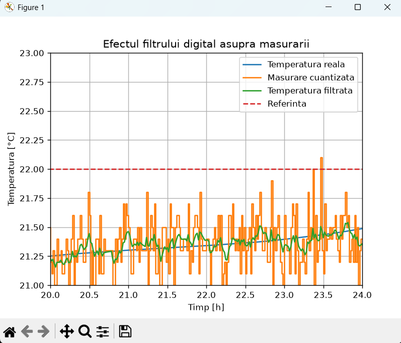

---

# 9. Criteriile de performanță

În locul alegerii parametrilor doar „după aspectul graficului”, au fost definite criterii cantitative.

Criteriile finale nominale sunt:

| Criteriu | Limită |
|---|---:|
| eroare staționară | $|e_{ss}|\le0.1^\circ C$ |
| suprareglaj | $M_p\le10\%$ |
| timp de stabilire la referință | $t_{s,r}\le6\ h$ |
| abatere maximă după perturbare | $\Delta T_{dist}\le1.8^\circ C$ |
| timp de restabilire după perturbare | $t_{s,d}\le12\ h$ |
| timp în saturație | $\le20\%$ |

Banda utilizată pentru timpul de stabilire este:

$$
22\pm0.2^\circ C
$$

Criteriul de `1.8 °C` pentru perturbare nu a fost valoarea inițială. El a rezultat ulterior, după analiza limitelor fizice ale centralei. Această corecție este una dintre etapele importante ale proiectului.

---

# 10. Prima căutare automată și de ce nu a funcționat

După definirea criteriilor a fost realizată o căutare pe o grilă de parametri $K_p$, $T_e$ și $T_f$.

Prima analiză a produs:

```text
Numar configuratii testate = 210
Numar configuratii valide = 0
```

Distribuția pe criterii a fost:

| Criteriu | Configurații care îl respectau |
|---|---:|
| eroare staționară | 203 / 210 |
| suprareglaj | 14 / 210 |
| timp de stabilire | 14 / 210 |
| perturbare | 0 / 210 |
| saturație | 210 / 210 |

Aceasta a fost o informație foarte importantă: problema nu era în primul rând eroarea staționară sau saturația, ci **rejecția perturbării**.

Cea mai apropiată configurație din acel test era aproximativ:

```text
Kp = 600
Ki = 0.03
Te = 60 s
Tf = 0 s

ess = 0.0984 °C
Mp = 10.04 %
ts = 6.72 h
dist = 3.1587 °C
sat = 0.51 %
```

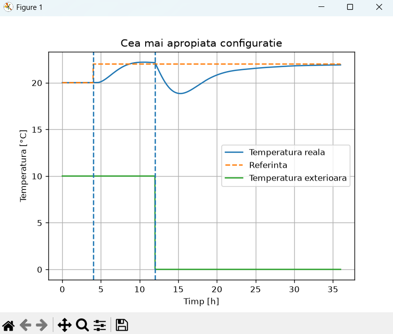

În loc să relaxăm imediat criteriile, s-a investigat motivul fizic pentru care perturbația era atât de greu de respins.

---

# 11. Compensarea temperaturii exterioare - feedforward

Temperatura exterioară este o perturbare care poate fi măsurată direct. Din acest motiv, a fost adăugată o ramură de compensare feedforward.

Pentru modelul termic:

$$
P_{pierderi}=K_{th}(T-T_{ext})
$$

Dacă temperatura exterioară scade cu $10^\circ C$, pierderea suplimentară nominală este:

$$
\Delta P=K_{th}\cdot10=250\cdot10=2500\ W
$$

Prin urmare:

$$
\boxed{P_{ff}=K_{th,nom}(T_{ext,initial}-T_{ext})}
$$

La perturbarea:

$$
T_{ext}:10^\circ C\rightarrow0^\circ C
$$

feedforward-ul adaugă imediat:

$$
P_{ff}=2500\ W
$$

Compararea PI simplu cu PI + feedforward a arătat o îmbunătățire clară a rejecției perturbării.

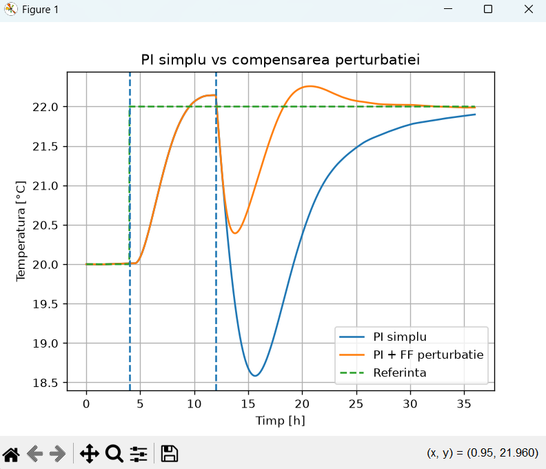

Într-un test intermediar, pentru aceeași configurație, abaterea s-a redus de la aproximativ:

$$
3.4169^\circ C
$$

la:

$$
1.6078^\circ C
$$

fără modificarea răspunsului la referință.

Totuși, criteriul inițial de $1^\circ C$ nu putea fi îndeplinit simultan cu toate celelalte criterii.

---

# 12. Încercarea cu două grade de libertate

Pentru a separa comportarea la schimbarea referinței de comportarea la perturbare s-a analizat și o variantă cu ponderarea referinței în acțiunea proporțională:

$$
e_P=\beta(r-r_0)-(y_f-r_0)
$$

în timp ce integratorul continua să folosească eroarea completă:

$$
e_I=r-y_f
$$

Au fost testate 1200 de configurații.

Rezultatul:

```text
Configuratii testate = 1200
Configuratii valide = 0
```

Configurația selectată automat avea:

```text
Kp = 500
Ki = 0.025
beta = 1.0
Te = 60 s
Tf = 300 s
```

Faptul că:

$$
\beta=1
$$

însemna că soluția selectată revenea practic la acțiunea PI clasică. Cu alte cuvinte, complexitatea suplimentară nu aducea un avantaj real pentru modelul și constrângerile proiectului.

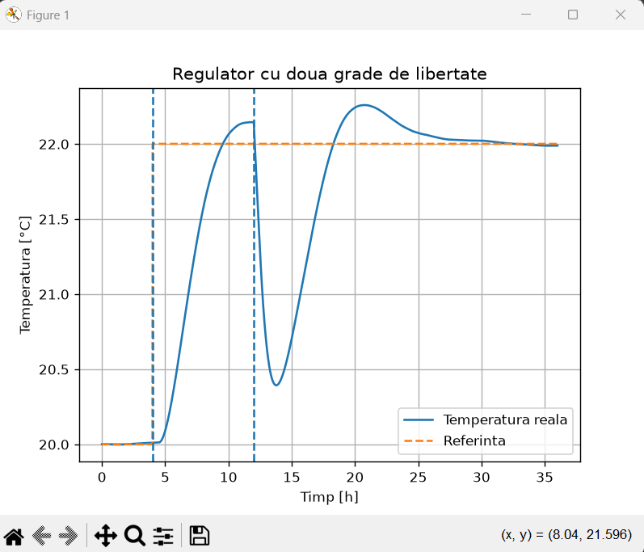

Această ramură a fost abandonată în forma finală.

---

# 13. Identificarea limitei fizice și corectarea metodologiei

Aceasta a fost etapa decisivă a proiectului.

## 13.1 Problema din testele anterioare

Inițial, saltul de referință și perturbarea erau evaluate în aceeași simulare. Astfel, în momentul apariției perturbării sistemul putea încă să poarte efectele tranzitoriului anterior.

Pentru evaluare corectă, testele au fost separate:

### Test A - urmărirea referinței

- stare inițială: $T=20^\circ C$;
- $T_{ext}=10^\circ C$ constant;
- la 4 h: $r:20\rightarrow22^\circ C$.

### Test B - rejecția perturbării

- sistemul pornește direct în echilibru la $T=r=22^\circ C$;
- $T_{ext}=10^\circ C$;
- la 4 h: $T_{ext}:10\rightarrow0^\circ C$;
- referința rămâne $22^\circ C$.

Astfel, indicatorul de perturbare măsoară exclusiv efectul perturbării.

## 13.2 Limita fizică a centralei

În noul regim staționar:

$$
T=22^\circ C,\qquad T_{ext}=0^\circ C
$$

puterea necesară numai pentru compensarea pierderilor este:

$$
P_{necesar}=K_{th}(22-0)=250\cdot22=5500\ W
$$

Centrala poate furniza maximum:

$$
P_{max}=6000\ W
$$

Rezerva disponibilă este deci numai:

$$
6000-5500=500\ W
$$

În plus, centrala are:

$$
T_B=3600\ s
$$

și timpul mort:

$$
L=1800\ s
$$

A fost construit un test idealizat în care, imediat ce apare perturbarea, regulatorul ar cere perfect $6000\ W$. Chiar și în acest caz temperatura scade cu aproximativ:

$$
\boxed{1.6415^\circ C}
$$

Prin urmare, criteriul inițial:

$$
\Delta T_{dist}\le1^\circ C
$$

era **fizic imposibil** pentru modelul actuatorului ales.

Criteriul de proiect a fost corectat la:

$$
\boxed{\Delta T_{dist}\le1.8^\circ C}
$$

Această modificare nu a fost făcută pentru a „forța” o soluție validă, ci după demonstrarea limitei fizice a procesului.

---

# 14. Regulatorul final

După corectarea metodologiei s-a refăcut căutarea automată.

Au fost testate:

```text
85 configurații
```

și au fost găsite:

```text
14 configurații valide
```

Configurația finală selectată este:

| Parametru | Valoare |
|---|---:|
| $K_p$ | **450 W/°C** |
| $K_i$ | **0.0225 W/(°C·s)** |
| $T_i$ | **20000 s** |
| $T_e$ | **60 s** |
| $T_f$ | **120 s** |
| $P_{max}$ | **6000 W** |
| cuantizare $q$ | **0.1 °C** |
| zgomot $\sigma$ | **0.2 °C** |

## 14.1 Legea finală de comandă

Pentru fiecare eșantion:

$$
e[k]=r[k]-y_f[k]
$$

$$
x_I[k+1]=x_I[k]+T_e e[k]
$$

$$
P_P[k]=K_p e[k]
$$

$$
P_I[k]=K_i x_I[k]
$$

$$
P_{ff}[k]=K_{th,nom}(T_{ext,0}-T_{ext}[k])
$$

Comanda nesaturată este:

$$
P^*[k]=P_0+P_{ff}[k]+P_P[k]+P_I[k]
$$

iar comanda aplicată este:

$$
\boxed{
P_{cmd}[k]=\operatorname{clip}(P^*[k],0,6000)
}
$$

Dacă saturația este provocată în sensul în care integrarea ar agrava situația, starea integratorului este înghețată.

## 14.2 Modelul discret al centralei

Puterea efectivă este actualizată cu:

$$
P[k+1]=P[k]+T_e\frac{P_{delayed}[k]-P[k]}{T_B}
$$

Timpul mort este implementat printr-un buffer de:

$$
N_L=\frac{L}{T_e}=30
$$

eșantioane.

## 14.3 Modelul discret al încăperii

$$
T[k+1]=T[k]+
T_e\frac{P[k]-K_{th}(T[k]-T_{ext}[k])}{C_{th}}
$$

---

# 15. Validarea nominală

## 15.1 Răspuns la referință

Rezultatele nominale sunt:

| Indicator | Rezultat | Criteriu |
|---|---:|---:|
| eroare staționară | **0.0110 °C** | ≤ 0.1 °C |
| suprareglaj | **4.76 %** | ≤ 10 % |
| timp de stabilire | **5.28 h** | ≤ 6 h |
| saturație | **0 %** | ≤ 20 % |

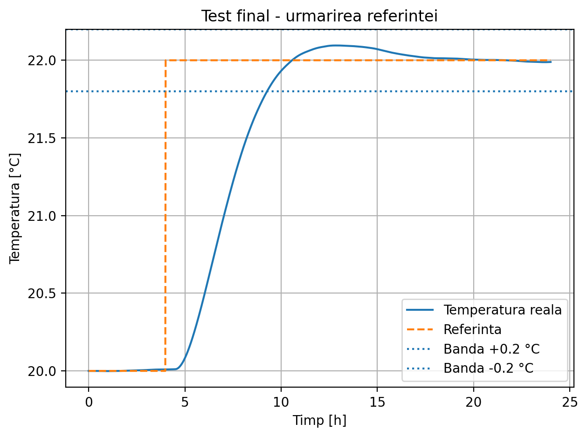

## 15.2 Rejecția perturbării

| Indicator | Rezultat | Criteriu |
|---|---:|---:|
| abatere maximă | **1.6929 °C** | ≤ 1.8 °C |
| timp de restabilire | **11.67 h** | ≤ 12 h |
| saturație | **12.70 %** | ≤ 20 % |

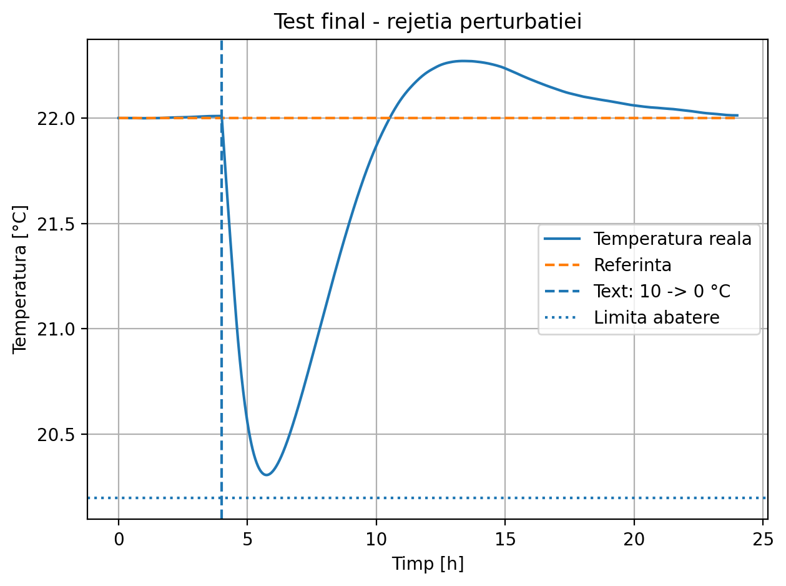

De remarcat este faptul că abaterea nominală de `1.6929 °C` este foarte apropiată de limita fizică idealizată de aproximativ `1.6415 °C`.

## 15.3 Senzorul și filtrarea

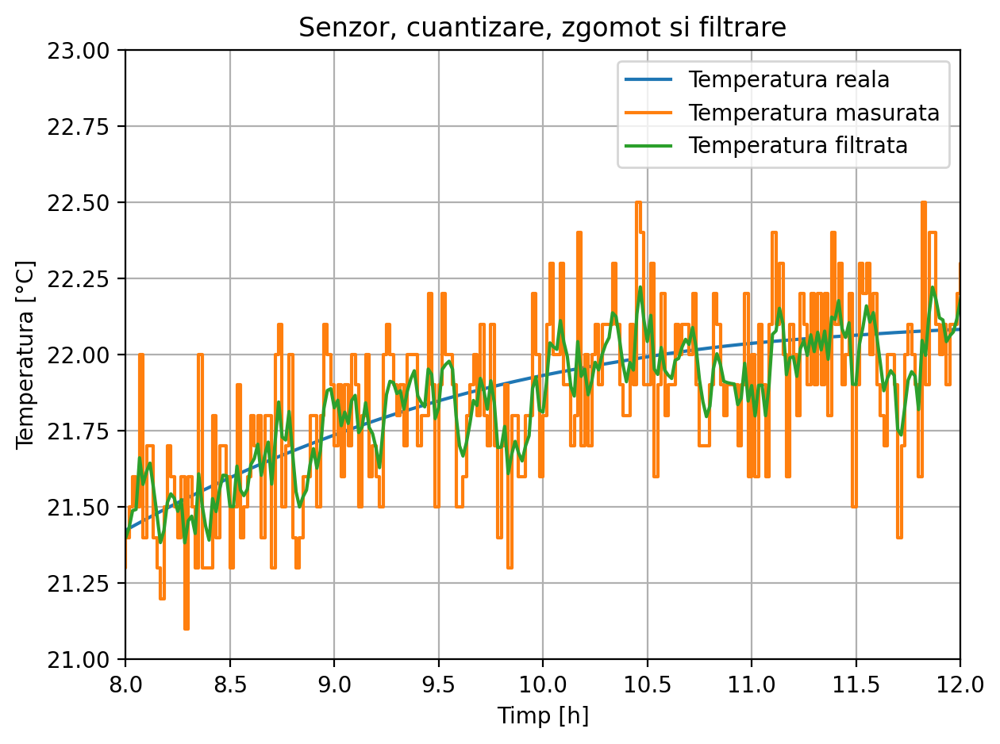

Graficul arată diferența dintre:

- temperatura reală;
- valoarea măsurată, afectată de zgomot și cuantizare;
- valoarea filtrată folosită efectiv de regulator.

## 15.4 Puterea centralei

### Test de referință

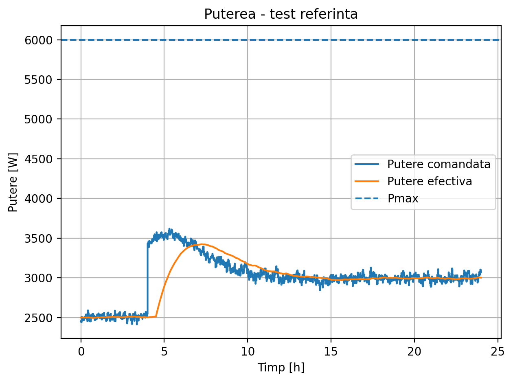

### Test de perturbare

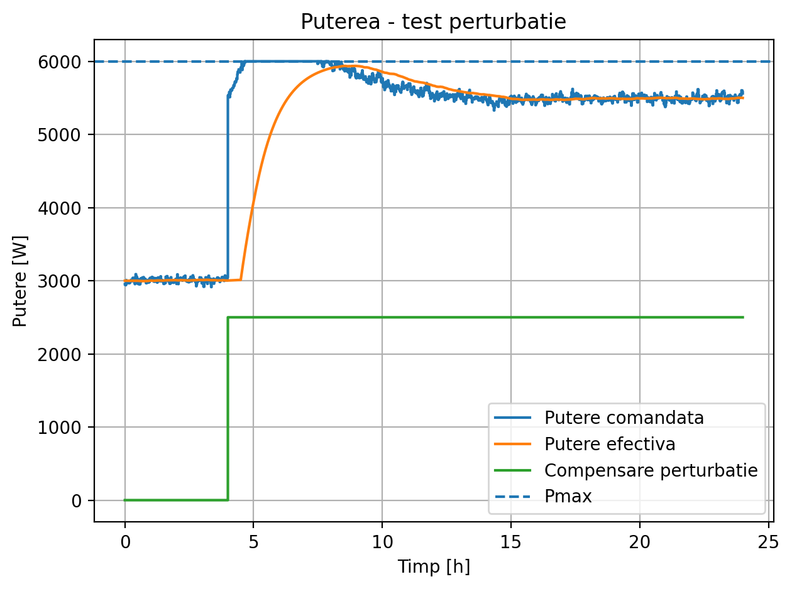

În testul de perturbare se vede direct rolul feedforward-ului: la scăderea temperaturii exterioare apare o compensare nominală de `2500 W`, după care PI-ul corectează eroarea reziduală.

---

# 16. Analiza de robustețe

Un regulator acordat pe modelul nominal trebuie verificat și atunci când procesul real diferă de model.

Regulatorul a fost păstrat **fix**, iar parametrii procesului au fost modificați.

Domeniul de testare a fost:

| Parametru | Interval |
|---|---:|
| $C_{th}$ | ±20 % |
| $K_{th}$ | ±5 % |
| $T_B$ | ±20 % |
| $L$ | ±20 % |

Au fost testate toate cele:

$$
2^4=16
$$

combinații extreme.

### Observație importantă privind $K_{th}$

La $22^\circ C$ și $0^\circ C$ exterior, limita absolută pentru pierderile termice este:

$$
K_{th,max}=\frac{P_{max}}{22}=272.73\ W/^\circ C
$$

adică doar aproximativ `+9.09 %` față de valoarea nominală. Din acest motiv, pentru testul de robustețe s-a ales ±5 %, astfel încât toate cazurile să rămână fizic fezabile în regim staționar.

## 16.1 Răspunsurile la referință

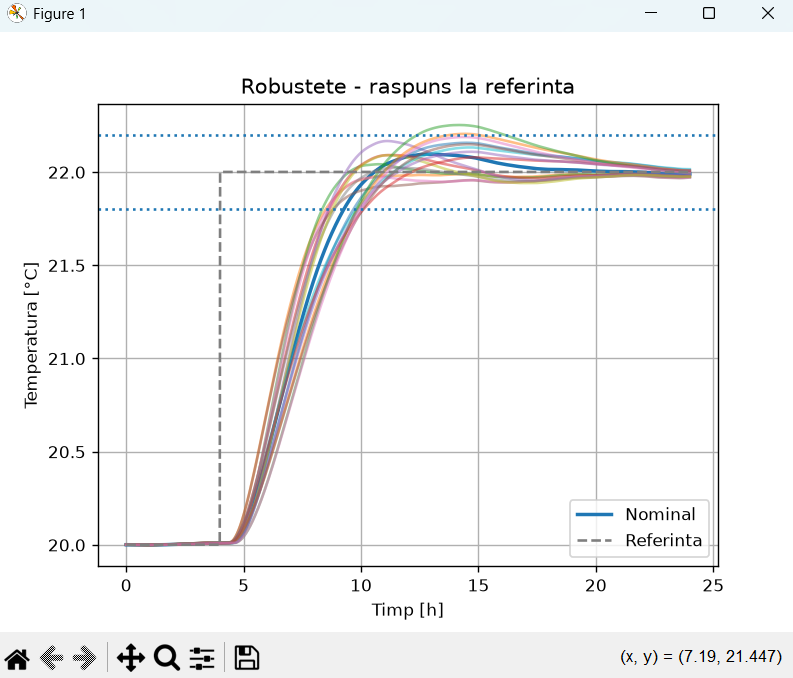

## 16.2 Răspunsurile la perturbare

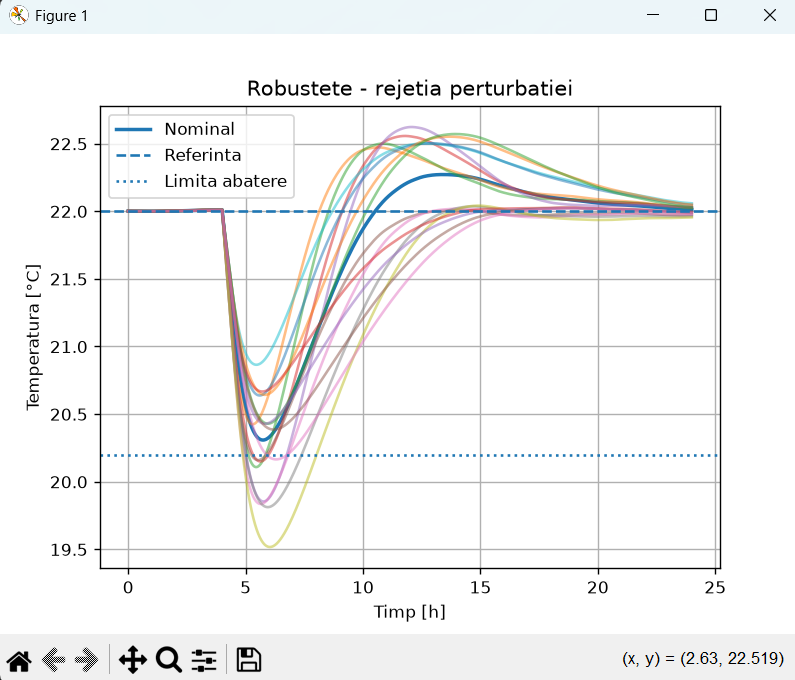

Doar `1 / 16` dintre colțurile extreme respectă simultan **toate criteriile nominale**. Acest rezultat nu înseamnă că celelalte 15 cazuri devin instabile. Simulările rămân mărginite, dar performanțele tranzitorii cerute nominal se degradează când procesul se îndepărtează mult de modelul de proiectare.

## 16.3 Worst-case

Cel mai sever caz pentru rejecția perturbării a fost:

```text
Cth = 4 000 000 J/°C
Kth = 262.5 W/°C
TB  = 4320 s
L   = 2160 s
```

Rezultatul regulatorului:

$$
\Delta T_{reg}=2.4838^\circ C
$$

Limita fizică idealizată pentru **același proces** este:

$$
\Delta T_{ideal}=2.4661^\circ C
$$

Diferența este:

$$
2.4838-2.4661=0.0177^\circ C
$$

adică numai:

$$
\boxed{0.72\%}
$$

peste limita fizică.

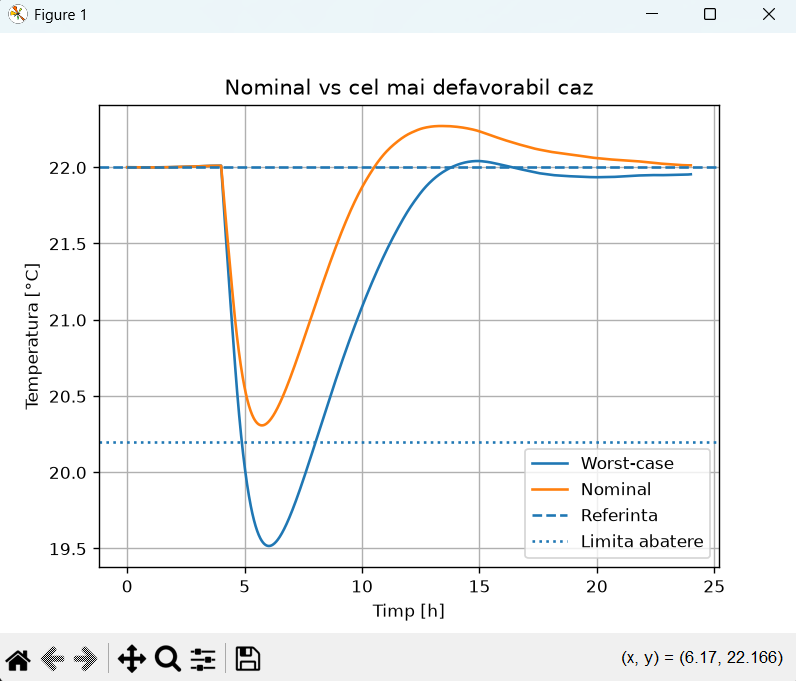

Concluzia este importantă: în cazurile severe, limitarea dominantă nu mai este acordarea PI-ului, ci combinația dintre:

- puterea maximă de `6000 W`;
- timpul mort;
- dinamica lentă a centralei;
- pierderile termice crescute.

Acest lucru este vizibil și comparând direct regulatorul cu limita fizică idealizată:

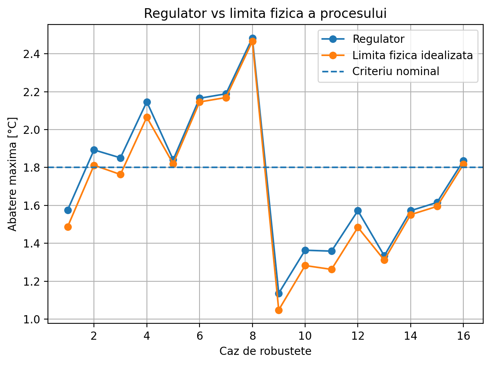

---

# 17. Monte Carlo pentru zgomotul senzorului

Pentru a verifica dacă rezultatele nominale nu depind accidental de o singură secvență de zgomot, s-au efectuat:

$$
\boxed{50\ simulări}
$$

cu seed-uri diferite.

Rezultatul:

```text
50 / 50 simulări au respectat toate criteriile nominale
```

## 17.1 Statistici

| Indicator | Medie | Std | Min | Max |
|---|---:|---:|---:|---:|
| eroare staționară [°C] | 0.0033 | 0.0108 | -0.0272 | 0.0245 |
| suprareglaj [%] | 4.3963 | 0.5342 | 3.1604 | 5.4234 |
| timp stabilire referință [h] | 5.2807 | 0.0493 | 5.1667 | 5.4000 |
| abatere perturbare [°C] | 1.7118 | 0.0126 | 1.6739 | 1.7372 |
| timp restabilire perturbare [h] | 10.8747 | 0.3562 | 9.9833 | 11.6667 |

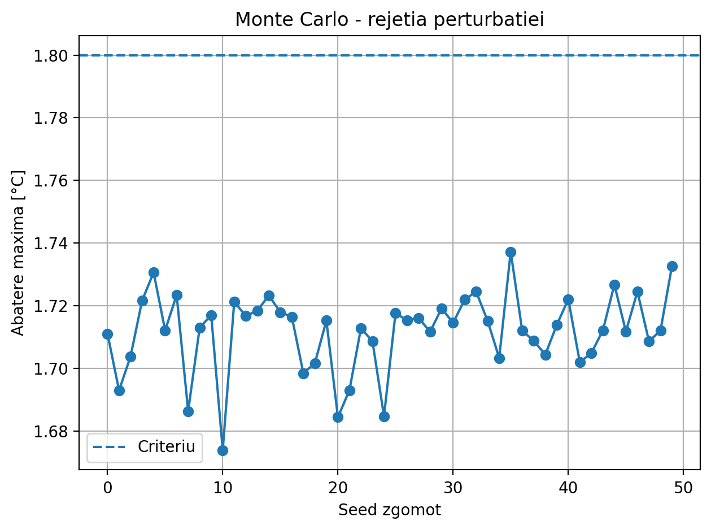

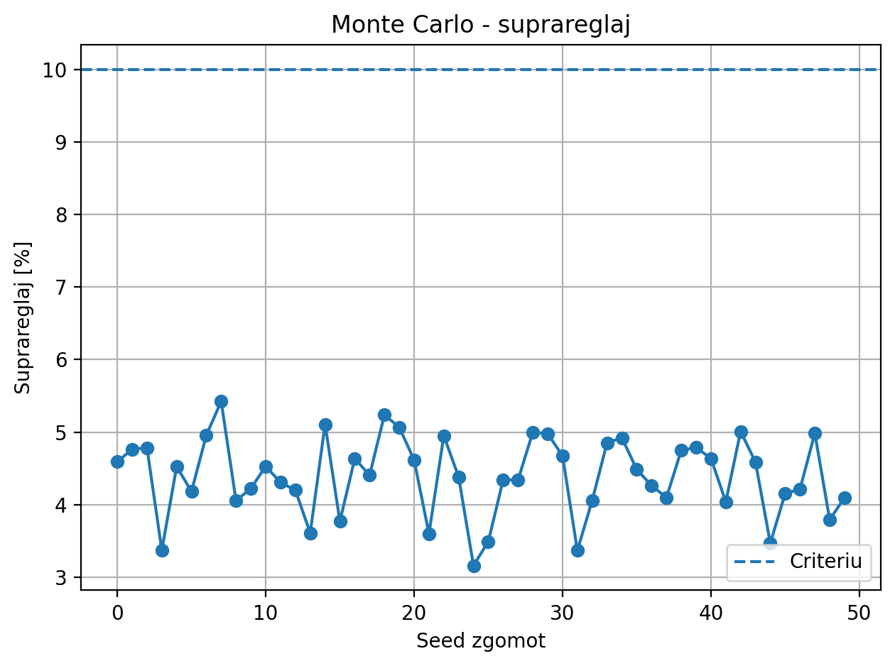

Faptul că toate cele 50 de realizări rămân sub limite arată că soluția nominală este puțin sensibilă la secvența particulară de zgomot folosită în simulare.

---

# 18. Cum se rulează proiectul

## Cerințe

- Python 3.10+;
- `numpy`;
- `matplotlib`.

## Instalare

```bash
git clone <URL-ul-repository-ului>
cd <numele-repository-ului>

python -m venv .venv
```

### Windows

```bash
.venv\Scripts\activate
pip install -r requirements.txt
python main.py
```

Pentru utilizarea interactivă, cu temperaturi alese de utilizator:

```bash
python boiler_simulator.py
```

### Linux / macOS

```bash
source .venv/bin/activate
pip install -r requirements.txt
python main.py
```

Pentru utilizarea interactivă, cu temperaturi alese de utilizator:

```bash
python boiler_simulator.py
```

`main.py` reproduce validarea inginerească a configurației finale și regenerează automat în folderul `results/`:

- graficele nominale;
- seriile temporale CSV;
- tabelul de robustețe;
- rezultatele Monte Carlo;
- fișierul cu parametrii finali.

`boiler_simulator.py` folosește același regulator final, dar permite introducerea unei temperaturi interioare inițiale, a unei temperaturi dorite și a temperaturii exterioare. Programul verifică și dacă referința poate fi menținută fizic cu limita de `6000 W`.

---


## Rezultatul final, pe scurt

```text
Controller: PI + outdoor-temperature feedforward + anti-windup

Kp = 450 W/°C
Ki = 0.0225 W/(°C*s)
Ti = 20000 s
Te = 60 s
Tf = 120 s
Pmax = 6000 W
q = 0.1 °C
sigma_noise = 0.2 °C

Nominal:
ess = 0.0110 °C
overshoot = 4.76 %
settling time = 5.28 h
disturbance deviation = 1.6929 °C
disturbance recovery = 11.67 h

Monte Carlo:
50 / 50 simulations passed the nominal criteria

Worst parametric case:
controller deviation = 2.4838 °C
ideal physical limit = 2.4661 °C
gap = 0.72 %
```

---

### Notă

Acest repository documentează nu doar soluția finală, ci și traseul până la ea: modele simplificate, încercări nereușite, criterii imposibile, corectarea metodei de testare și analiza limitelor fizice. Această evoluție este intenționat păstrată deoarece reprezintă partea esențială a procesului de proiectare inginerească.
