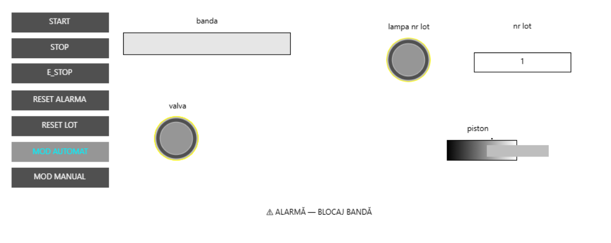
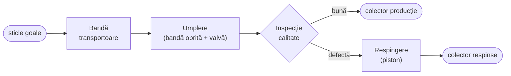
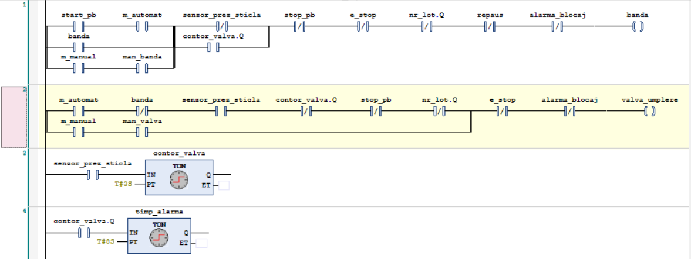
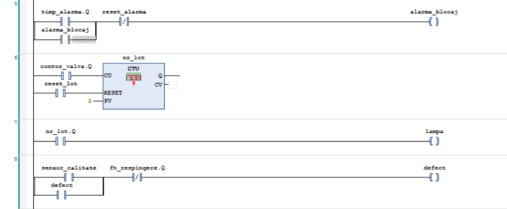
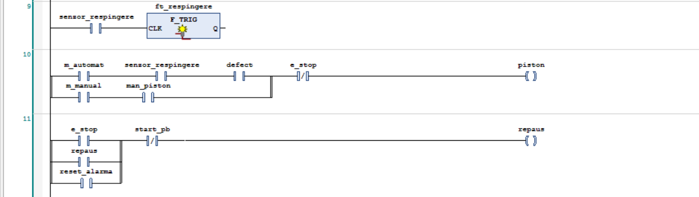
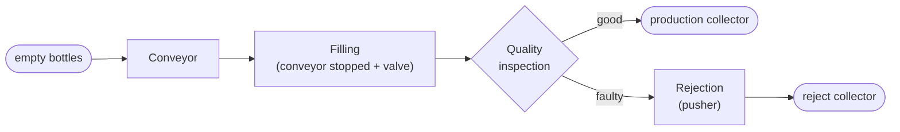

# Linie automată de îmbuteliere cu HMI (CODESYS)
### Automated bottling line with HMI (CODESYS)

Sistem de comandă pentru o linie de îmbuteliere cu bandă transportoare indexată, umplere temporizată, numărare de lot, inspecție de calitate cu respingere automată, oprire de avarie, regim manual/automat, alarme și un panou de operator (HMI) construit în CODESYS Visualization. Realizat integral în Ladder, testat în simulare, fără hardware fizic.

*Control system for a bottling line with an indexing conveyor, timed filling, batch counting, quality inspection with automatic rejection, emergency stop, manual/automatic modes, alarms, and an operator panel (HMI) built in CODESYS Visualization. Implemented entirely in Ladder, tested in simulation, with no physical hardware.*

---

**🌐 Limbă / Language:** [Română](#-română) · [English](#-english)

---

## 🇷🇴 Română

- [Descriere](#descriere)
- [Fluxul procesului](#fluxul-procesului)
- [Variabile (I/O)](#variabile-io)
- [Cum funcționează](#cum-funcționează)
- [Panoul de operator (HMI)](#panoul-de-operator-hmi)
- [Logica programului](#logica-programului)
- [Concepte demonstrate](#concepte-demonstrate)
- [Cum se rulează](#cum-se-rulează)
- [Realizat cu](#realizat-cu)

### Descriere

Instalația comandată este o linie de îmbuteliere formată dintr-o bandă transportoare care duce sticlele prin trei stații: o stație de umplere (valvă + senzor de prezență), o stație de inspecție (senzor de calitate) și o stație de respingere (piston pneumatic + senzor de prezență). Sticlele bune ajung în colectorul de producție, iar cele defecte sunt împinse afară de piston.

Sistemul trebuia să automatizeze întregul ciclu de producție — transport, umplere, numărare pe loturi, control de calitate cu respingere selectivă — și să adauge peste el funcțiile unei instalații reale complete: oprire de avarie prioritară, regim manual pentru mentenanță, supraveghere cu alarme, și un panou de operator vizual prin care linia să poată fi comandată și monitorizată fără a atinge codul.

### Fluxul procesului

### Variabile (I/O)

**Intrări**

| Variabilă | Tip | Rol |
|---|---|---|
| `start_pb` | `BOOL` | Buton de pornire a liniei |
| `stop_pb` | `BOOL` | Buton de oprire a liniei |
| `e_stop` | `BOOL` | Buton de avarie (prioritate absolută) |
| `senzor_prez_sticla` | `BOOL` | Prezența unei sticle la stația de umplere |
| `senzor_calitate` | `BOOL` | Semnalează o sticlă defectă la inspecție |
| `senzor_respingere` | `BOOL` | Prezența unei sticle la stația de respingere |
| `m_automat` | `BOOL` | Selecție regim automat |
| `m_manual` | `BOOL` | Selecție regim manual |
| `man_banda` | `BOOL` | Comandă manuală a benzii |
| `man_valva` | `BOOL` | Comandă manuală a valvei de umplere |
| `man_piston` | `BOOL` | Comandă manuală a pistonului |
| `reset_lot` | `BOOL` | Resetare a contorului de lot |
| `reset_alarma` | `BOOL` | Confirmare / resetare a alarmei |

**Ieșiri**

| Variabilă | Tip | Rol |
|---|---|---|
| `banda` | `BOOL` | Motorul benzii transportoare |
| `valva_umplere` | `BOOL` | Valva de umplere |
| `piston` | `BOOL` | Pistonul de respingere |
| `lampa` | `BOOL` | Lampă „lot complet" |
| `alarma_blocaj` | `BOOL` | Lampă de alarmă blocaj |

**Interne (memorii, temporizatoare, contoare)**

| Variabilă | Tip | Rol |
|---|---|---|
| `repaus` | `BOOL` | Starea de repaus a liniei (activă doar când niciun proces nu rulează) |
| `defect` | `BOOL` | Memorie (latch): sticla aflată în drum spre piston este defectă |
| `nr_lot` | `CTU` | Contor al sticlelor umplute (dimensiune de lot configurabilă) |
| `contor_valva` | `TON` | Temporizator de umplere (durata fixă de umplere) |
| `timp_alarma` | `TON` | Watchdog pentru detecția blocajului |
| `ft_respingere` | `F_TRIG` | Front căzător pe `senzor_respingere` (resetează memoria `defect`) |

### Cum funcționează

**Transport și umplere cu bandă indexată.** Banda merge continuu și aduce sticlele goale spre stația de umplere. Când senzorul detectează o sticlă în poziție, banda se oprește. Cu banda oprită și sticla la locul ei, valva de umplere se deschide exact pe durata temporizatorului de umplere; după expirarea acestuia, valva se închide și banda repornește, ducând sticla plină mai departe și aducând următoarea. Valva se deschide numai cu banda oprită și o sticlă prezentă — banda nu se mișcă niciodată în timpul umplerii.

**Numărare pe loturi.** Fiecare sticlă umplută complet este numărată o singură dată, folosind numărarea pe front crescător a contorului (`CU` primește semnalul de „umplere terminată", astfel încât o sticlă adaugă exact o unitate, nu în mod repetat). La atingerea dimensiunii lotului, linia se oprește automat și se aprinde lampa de „lot complet"; butonul de resetare a lotului readuce numărătoarea la zero pentru un lot nou. Oprirea generală nu șterge numărătoarea — producția se reia de unde a rămas.

**Inspecție și respingere cu urmărirea sticlei.** La inspecție, senzorul de calitate marchează o sticlă defectă. Deoarece stația de respingere este mai departe pe bandă, defectul nu poate fi tratat pe loc: o memorie de tip latch reține că sticla aflată în tranzit este defectă. Când acea sticlă ajunge la stația de respingere, pistonul se activează și o împinge afară. Memoria se resetează pe **frontul căzător** al senzorului de respingere (blocul `F_TRIG`) — adică fix în momentul în care sticla defectă a părăsit pistonul — pentru a evita auto-anularea (dacă memoria s-ar șterge chiar la sosirea sticlei, pistonul ar rămâne fără condiție). Sticlele bune trec neatinse; pistonul nu se activează pentru ele.

**Oprire de avarie.** Butonul de avarie are prioritate absolută în orice regim: oprește instantaneu toate ieșirile (bandă, valvă, piston), blochează pornirea cât timp este apăsat, și readuce linia în starea de repaus la eliberare — de unde un Start nou pornește un ciclu complet de la început, nu de unde s-a întrerupt.

**Regim manual / automat.** Un selector alege regimul. În automat rulează întregul ciclu descris mai sus. În manual, ciclul este dezactivat, iar operatorul comandă direct banda, valva și pistonul prin butoane dedicate, pentru mentenanță și testare. Fiecare ieșire este comandată dintr-o singură bobină, cu două căi paralele (automată și manuală) selectate de regim — fără dublarea bobinelor.

**Alarmă de blocaj.** Un watchdog supraveghează stația de umplere: dacă o sticlă rămâne în poziție un timp anormal de lung (blocaj, sticlă înțepenită), se declanșează o alarmă. Alarma este memorată (rămâne activă chiar dacă între timp cauza dispare), oprește linia și se stinge doar la apăsarea butonului de resetare a alarmelor, după remedierea defectului.

**Starea de repaus.** O stare internă de „repaus" este activă doar atunci când niciun alt proces nu rulează. Ea permite pornirea curată de la Start și este starea în care revine linia după o avarie sau după completarea unui lot, garantând că un ciclu nou pornește întotdeauna de la început.

### Panoul de operator (HMI)

Panoul, construit în CODESYS Visualization, permite comanda și monitorizarea liniei fără a interacționa cu codul sau cu tabelul de variabile. Toată logica rămâne în programul Ladder; HMI-ul este doar un strat de vizualizare așezat peste el.

Panoul conține: butoane de comandă (Start, Stop, Avarie, Reset alarmă, Reset lot) și selector de regim (Automat / Manual); lămpi de stare pentru bandă, valvă, piston și lot complet, legate prin culoare de variabilele corespunzătoare; un afișaj numeric al contorului de lot, actualizat în timp real; și un banner de alarmă vizibil doar când alarma de blocaj este activă.

Elementele de citire (lămpi, afișaj) reflectă starea instalației (PLC → HMI), iar cele de scriere (butoane) transmit comenzi către program (HMI → PLC). Butoanele momentane folosesc comportament de tip „apasă și ține", iar selectorul de regim folosește comutare (toggle).

### Logica programului

Programul Ladder complet (bandă, valvă, temporizatoare, contor de lot, memorie de defect cu front căzător, piston, avarie, alarmă, repaus):

### Concepte demonstrate

- Bandă transportoare indexată (oprire-pornire declanșată de senzor)
- Numărare pe front crescător (CTU) — o sticlă numărată exact o dată
- Urmărirea unei piese între stații: memorie de tip latch + resetare pe front căzător
- Detecția de front crescător / căzător (`F_TRIG`)
- Oprire de avarie cu resetare curată a stării și repornire de la început
- Comandă dublă automată/manuală pe o singură ieșire, fără dublarea bobinelor
- Alarmă memorată cu watchdog (temporizator TON)
- Stare de repaus definită ca „niciun alt proces activ"
- HMI în CODESYS Visualization: binding de citire (culoare, text numeric, vizibilitate condiționată) și de scriere (apasă-și-ține, comutare)

### Cum se rulează

1. Se deschide proiectul în **CODESYS V3.5** cu device-ul **CODESYS Control Win V3** (PLC soft).
2. `Online → Simulation`, apoi `Login` și `Start` (nu este nevoie de hardware).
3. Se deschide obiectul de **Visualization** (HMI) în modul de rulare.
4. Se comandă linia de pe panou: Start pornește producția; se simulează sosirea sticlelor, sticlele defecte și blocajele fie de pe panou, fie forțând senzorii din lista de monitorizare.
5. Se pot verifica toate scenariile: umplere și numărare de lot, respingerea corectă a sticlelor defecte, oprirea de avarie, comutarea automat/manual și declanșarea alarmei de blocaj.

### Realizat cu

- **CODESYS V3.5** (cu simulator integrat)
- **Ladder Logic Diagram (IEC 61131-3)** — logica de comandă
- **CODESYS Visualization** — panoul de operator (HMI)
- Blocuri de bibliotecă: `TON`, `CTU`, `F_TRIG`

---

## 🇬🇧 English

- [Overview](#overview)
- [Process flow](#process-flow)
- [Variables (I/O)](#variables-io)
- [How it works](#how-it-works)
- [Operator panel (HMI)](#operator-panel-hmi)
- [Program logic](#program-logic)
- [Concepts demonstrated](#concepts-demonstrated)
- [How to run](#how-to-run)
- [Built with](#built-with)

### Overview

The controlled plant is a bottling line consisting of a conveyor that carries bottles through three stations: a filling station (valve + presence sensor), an inspection station (quality sensor), and a rejection station (pneumatic pusher + presence sensor). Good bottles reach the production collector, while faulty ones are pushed off the line by the pusher.

The system had to automate the entire production cycle — transport, filling, batch counting, quality control with selective rejection — and add, on top of it, the functions of a complete real installation: priority emergency stop, a manual mode for maintenance, alarm supervision, and a visual operator panel through which the line can be commanded and monitored without touching the code.

### Process flow

### Variables (I/O)

**Inputs**

| Variable | Type | Role |
|---|---|---|
| `start_pb` | `BOOL` | Line start button |
| `stop_pb` | `BOOL` | Line stop button |
| `e_stop` | `BOOL` | Emergency-stop button (absolute priority) |
| `senzor_prez_sticla` | `BOOL` | Bottle present at the filling station |
| `senzor_calitate` | `BOOL` | Signals a faulty bottle at inspection |
| `senzor_respingere` | `BOOL` | Bottle present at the rejection station |
| `m_automat` | `BOOL` | Automatic mode selection |
| `m_manual` | `BOOL` | Manual mode selection |
| `man_banda` | `BOOL` | Manual conveyor command |
| `man_valva` | `BOOL` | Manual fill-valve command |
| `man_piston` | `BOOL` | Manual pusher command |
| `reset_lot` | `BOOL` | Batch counter reset |
| `reset_alarma` | `BOOL` | Alarm acknowledge / reset |

**Outputs**

| Variable | Type | Role |
|---|---|---|
| `banda` | `BOOL` | Conveyor motor |
| `valva_umplere` | `BOOL` | Fill valve |
| `piston` | `BOOL` | Rejection pusher |
| `lampa` | `BOOL` | "Batch complete" lamp |
| `alarma_blocaj` | `BOOL` | Jam-alarm lamp |

**Internal (memories, timers, counters)**

| Variable | Type | Role |
|---|---|---|
| `repaus` | `BOOL` | Line idle state (active only when no process is running) |
| `defect` | `BOOL` | Latch: the bottle travelling toward the pusher is faulty |
| `nr_lot` | `CTU` | Filled-bottle counter (configurable batch size) |
| `contor_valva` | `TON` | Fill timer (fixed fill duration) |
| `timp_alarma` | `TON` | Watchdog for jam detection |
| `ft_respingere` | `F_TRIG` | Falling edge on `senzor_respingere` (resets the `defect` latch) |

### How it works

**Transport and filling with an indexing conveyor.** The conveyor runs continuously and brings empty bottles to the filling station. When the sensor detects a bottle in position, the conveyor stops. With the conveyor stopped and the bottle in place, the fill valve opens for exactly the fill-timer duration; once it expires, the valve closes and the conveyor restarts, carrying the full bottle onward and bringing the next one. The valve opens only with the conveyor stopped and a bottle present — the conveyor never moves during filling.

**Batch counting.** Each fully filled bottle is counted once, using the counter's rising-edge counting (`CU` receives the "fill complete" signal, so a bottle adds exactly one unit, not repeatedly). When the batch size is reached, the line stops automatically and the "batch complete" lamp lights; the batch-reset button clears the count for a new batch. The general stop does not clear the count — production resumes where it left off.

**Inspection and rejection with item tracking.** At inspection, the quality sensor marks a faulty bottle. Because the rejection station is further along the conveyor, the fault cannot be handled on the spot: a latch memory remembers that the bottle in transit is faulty. When that bottle reaches the rejection station, the pusher activates and pushes it off. The memory is reset on the **falling edge** of the reject sensor (the `F_TRIG` block) — exactly when the faulty bottle has left the pusher — to avoid self-cancellation (if the memory were cleared the moment the bottle arrived, the pusher would lose its condition). Good bottles pass untouched; the pusher does not activate for them.

**Emergency stop.** The emergency button has absolute priority in any mode: it instantly stops all outputs (conveyor, valve, pusher), blocks any start while pressed, and returns the line to the idle state on release — from which a new Start begins a full cycle from the beginning, not from where it was interrupted.

**Manual / automatic mode.** A selector chooses the mode. In automatic, the full cycle described above runs. In manual, the cycle is disabled and the operator directly commands the conveyor, valve, and pusher through dedicated buttons, for maintenance and testing. Each output is driven by a single coil, with two parallel paths (automatic and manual) selected by mode — no duplicate coils.

**Jam alarm.** A watchdog supervises the filling station: if a bottle stays in position for an abnormally long time (a jam, a stuck bottle), an alarm is triggered. The alarm is latched (it stays active even if the cause disappears meanwhile), stops the line, and clears only when the alarm-reset button is pressed after the fault is fixed.

**Idle state.** An internal "idle" state is active only when no other process is running. It enables a clean start from Start and is the state the line returns to after an emergency stop or after completing a batch, guaranteeing that a new cycle always begins from the start.

### Operator panel (HMI)

The panel, built in CODESYS Visualization, allows commanding and monitoring the line without interacting with the code or the variable table. All logic stays in the Ladder program; the HMI is only a visualization layer placed on top of it.

The panel contains: command buttons (Start, Stop, Emergency, Alarm reset, Batch reset) and a mode selector (Automatic / Manual); status lamps for the conveyor, valve, pusher, and batch complete, bound by colour to the corresponding variables; a numeric display of the batch counter, updated in real time; and an alarm banner visible only when the jam alarm is active.

Read elements (lamps, display) reflect plant state (PLC → HMI), while write elements (buttons) send commands to the program (HMI → PLC). Momentary buttons use "tap" behaviour, and the mode selector uses toggle.

### Program logic

The complete Ladder program (conveyor, valve, timers, batch counter, fault memory with falling edge, pusher, emergency stop, alarm, idle):

### Concepts demonstrated

- Indexing conveyor (sensor-triggered stop-and-go)
- Rising-edge counting (CTU) — a bottle counted exactly once
- Item tracking between stations: latch memory + falling-edge reset
- Rising / falling edge detection (`F_TRIG`)
- Emergency stop with clean state reset and restart from the beginning
- Dual automatic/manual command on a single output, without duplicate coils
- Latched alarm with a watchdog (TON timer)
- Idle state defined as "no other process active"
- HMI in CODESYS Visualization: read binding (colour, numeric text, conditional visibility) and write binding (tap, toggle)

### How to run

1. Open the project in **CODESYS V3.5** with the **CODESYS Control Win V3** device (soft PLC).
2. `Online → Simulation`, then `Login` and `Start` (no hardware required).
3. Open the **Visualization** object (HMI) in run mode.
4. Command the line from the panel: Start begins production; bottle arrivals, faulty bottles, and jams are simulated either from the panel or by forcing the sensors from the watch list.
5. All scenarios can be verified: filling and batch counting, correct rejection of faulty bottles, emergency stop, automatic/manual switching, and jam-alarm triggering.

### Built with

- **CODESYS V3.5** (with built-in simulator)
- **Ladder Logic Diagram (IEC 61131-3)** — control logic
- **CODESYS Visualization** — operator panel (HMI)
- Library blocks: `TON`, `CTU`, `F_TRIG`
